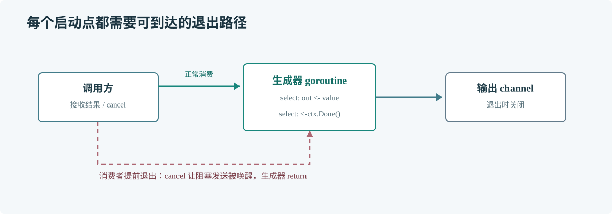

# 第 53 章 Goroutine 泄漏

## 场景

用户取消订单查询，但后台仍不断产生查询结果；接收端已经退出，生产 goroutine 堵在 channel 发送上。长时间运行后 goroutine 数和堆内存逐渐上升。

## 问题

Goroutine 泄漏是已无业务价值但仍无法退出的 goroutine。常见原因包括无人接收的 channel 发送、永不结束的阻塞 IO、忘记调用 cancel，以及退出路径没有释放资源。

## 实现

生成器通过 Context 接收取消信号，并在所有退出路径关闭输出 channel。

> **图解**：调用方正常消费时读到 channel 关闭；提前放弃时调用 cancel，生成器从发送和等待处观察取消并退出。每个启动点都应有可到达的结束路径。

~~~go
package main

import (
    "context"
    "fmt"
    "runtime"
    "time"
)

func generate(ctx context.Context) <-chan int {
    out := make(chan int)
    go func() {
        defer close(out)
        for value := 1; value <= 100; value++ {
            select {
            case <-ctx.Done():
                return
            case out <- value:
            }
        }
    }()
    return out
}

func main() {
    before := runtime.NumGoroutine()
    ctx, cancel := context.WithCancel(context.Background())
    values := generate(ctx)
    for value := range values {
        fmt.Println(value)
        if value == 3 {
            cancel()
        }
    }
    time.Sleep(20 * time.Millisecond)
    fmt.Printf("goroutines before=%d after=%d\n", before, runtime.NumGoroutine())
}
~~~

## 原理

Context 只是取消信号，不会强行终止 goroutine；代码必须检查 Done 并返回。channel 发送在没有接收者时会阻塞，因此消费者提前结束时要通知生产者。

## 最佳实践

- 启动 goroutine 的 API 应说明由谁取消、等待和回收。
- 必须调用 WithCancel、WithTimeout 创建的 cancel 函数。
- 网络和数据库 IO 设置超时或 deadline。
- 循环中的 ticker 在退出时调用 Stop。
- 服务关闭时停止接收新任务，通知后台任务退出并设置收尾期限。

## 排障

### goroutine profile 中同一栈反复出现

将 NumGoroutine 趋势与 /debug/pprof/goroutine?debug=2 对照，查看重复栈停在哪里以及由哪个请求启动。

### goroutine 卡在 channel send

检查消费者是否会提前返回；为发送增加 Context 分支，并确保消费者退出时取消生产者。

### 取消后 goroutine 仍不退出

检查阻塞操作是否支持取消。若第三方 API 不接收 Context，应加超时、连接关闭机制或隔离到可回收边界。

## 面试题

**Q1：调用 cancel 会不会终止 goroutine？**

A：不会。它关闭 Done channel 发送协作式信号，代码必须主动检查并返回。

**Q2：如何证明泄漏已修复？**

A：重复创建和取消工作流后，观察 goroutine profile 与数量是否回落，并确认关联资源释放。

## 小结

1. 每个 goroutine 都要有退出条件和责任方。
2. 取消要覆盖发送、接收、定时等待和外部 IO。
3. 用 profile 找阻塞栈，再修正生命周期协议。
