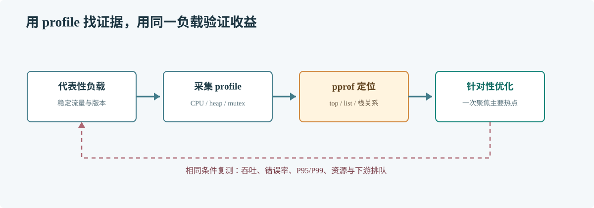

# 第 54 章 pprof 性能分析

## 场景

服务部署后 CPU 持续高于容量目标，扩容只能暂时缓解。团队需要区分热点计算、锁竞争、内存分配和 goroutine 堆积，再决定优化代码还是调整资源。

## 问题

CPU 百分比无法定位代码；单段 profile 也容易把启动抖动、压测流量和真实负载混在一起。采样应覆盖有代表性的稳定窗口，并与指标和版本信息对齐。

## 实现

在仅监听本机的诊断端口注册 pprof，并提供一个可控 CPU 计算接口。生产服务必须用网络策略保护诊断端口。

> **图解**：在稳定负载下采集 CPU、内存或 goroutine profile，用 top 和源码视图定位热点；一次只改主要因素，之后用相同负载比较业务延迟和资源消耗。

~~~go
package main

import (
    "fmt"
    "log"
    "net/http"
    _ "net/http/pprof"
    "strconv"
)

func cpuBound(n int) uint64 {
    var total uint64
    for i := 1; i <= n; i++ {
        total += uint64(i*i + i%7)
    }
    return total
}

func main() {
    app := http.NewServeMux()
    app.HandleFunc("/compute", func(w http.ResponseWriter, r *http.Request) {
        n, err := strconv.Atoi(r.URL.Query().Get("n"))
        if err != nil || n < 1 || n > 100_000_000 {
            http.Error(w, "n must be between 1 and 100000000", http.StatusBadRequest)
            return
        }
        fmt.Fprintln(w, cpuBound(n))
    })
    go func() {
        log.Println("pprof listening on 127.0.0.1:6060")
        log.Fatal(http.ListenAndServe("127.0.0.1:6060", nil))
    }()
    log.Fatal(http.ListenAndServe("127.0.0.1:8080", app))
}
~~~

运行服务并持续制造工作，再在另一个终端采样：

~~~sh
go run main.go
curl 'http://127.0.0.1:8080/compute?n=100000000'
go tool pprof 'http://127.0.0.1:6060/debug/pprof/profile?seconds=20'
~~~

在 pprof 交互界面使用 top 查看热点，使用 list cpuBound 对照源码；内存分配可采 allocs，当前存活对象可采 heap。

## 原理

pprof 以采样方式将运行时活动聚合到调用栈。CPU profile 反映窗口内消耗 CPU 的栈；heap 要区分分配总量和存活对象；mutex 与 block profile 可帮助寻找同步等待。

## 最佳实践

- 只在稳定、可重复的代表性负载下比较 profile。
- 诊断端口独立监听并加网络访问控制，不暴露到公网。
- 先确认是 CPU 饱和，而不是 IO 等待或连接池排队。
- 记录变更前后的 profile，并比较服务 SLI。
- 区分分配速率与保留对象，结合 allocs 和 heap 分析。

## 排障

### profile 没有明显热点

确认采样期间流量真实到达被分析进程、窗口足够长，并确认分析的是正确容器和版本。

### heap 看起来很大

区分 in-use 与 alloc-space，检查对象引用和业务流量是否造成持续增长。

### 线上无法连接 pprof

通过受控端口转发或内部运维入口访问。不要为临时分析把监听地址改成所有网卡。

## 面试题

**Q1：CPU profile 和 heap profile 分别回答什么？**

A：CPU profile 聚合采样窗口内消耗 CPU 的调用栈；heap profile 观察堆分配和存活对象，采样类型不同，不能互相替代。

**Q2：CPU profile 变好就代表用户体验变好吗？**

A：不一定。还需在相同负载下比较吞吐、错误率、P95/P99、内存和下游等待。

## 小结

1. 先定义问题和稳定负载，再采集对应类型的 profile。
2. 用 top 与源码列表把热点定位到具体路径。
3. 保护 pprof 入口，并用业务指标验证优化效果。
