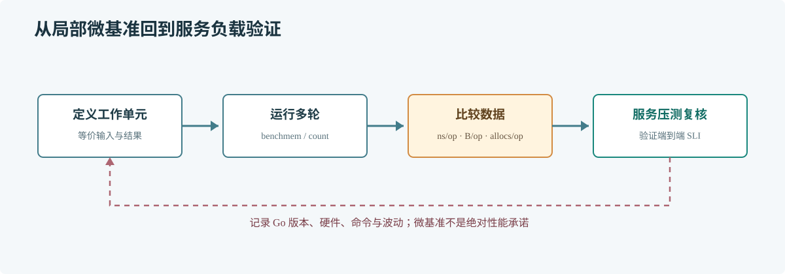

# 第 55 章 Benchmark 测试

## 场景

订单批处理要构造大量响应对象。团队考虑预分配 slice，想确认它是否降低分配次数和运行时间，而不是凭直觉把复杂度加进热路径。

## 问题

Benchmark 结果受机器负载、编译器、Go 版本、数据规模和测量方法影响。单次数字不是绝对性能结论，微基准也不能替代端到端压测。

## 实现

将示例保存为 slice_bench_test.go。两个基准使用相同输入，并通过全局变量保留结果，避免编译器消除工作。

> **图解**：定义真实待比较工作，保证输入和结果等价；多次运行并观察耗时与分配，确认结果稳定后，再回到服务压测验证用户可感知的收益。

~~~go
package benchmark

import "testing"

type Item struct {
    ID    int
    Price int64
}

var result []Item

func buildWithoutCapacity(n int) []Item {
    items := make([]Item, 0)
    for i := 0; i < n; i++ {
        items = append(items, Item{ID: i, Price: int64(i) * 100})
    }
    return items
}

func buildWithCapacity(n int) []Item {
    items := make([]Item, 0, n)
    for i := 0; i < n; i++ {
        items = append(items, Item{ID: i, Price: int64(i) * 100})
    }
    return items
}

func BenchmarkBuildWithoutCapacity(b *testing.B) {
    for i := 0; i < b.N; i++ {
        result = buildWithoutCapacity(1000)
    }
}

func BenchmarkBuildWithCapacity(b *testing.B) {
    for i := 0; i < b.N; i++ {
        result = buildWithCapacity(1000)
    }
}
~~~

运行 go test -run=^$ -bench=Build -benchmem -count=5，比较 ns/op、B/op 和 allocs/op。绝对数字不可直接跨机器比较；评估优化时保持 Go 版本、机器和输入一致。

## 原理

Benchmark 函数由 testing 框架按自适应迭代次数运行。b.N 随测量调整以稳定计时窗口；benchmem 会报告每次操作相关的分配指标。

基准只测量被调用路径。真实业务的 JSON 编码、数据库 IO、锁竞争和调度都不在 slice 构造微基准里。

## 最佳实践

- 两个候选实现必须处理相同输入并产生可比结果。
- 测量循环之外准备测试数据；用 StopTimer/StartTimer 排除初始化开销。
- 多次运行并检查波动；重大对比可用 benchstat 分析。
- 保存 Go 版本、硬件、命令和基线结果。
- 先用 benchmark 观察局部趋势，再用服务压测验证 SLI。

## 排障

### 基准结果接近零或明显不合理

检查结果是否被编译器消除、工作是否落在计时区间内，以及函数是否执行了预期工作量。

### 多次运行波动很大

减少后台负载，固定机器与电源状态，延长测量或重复运行，避免同时压测其他服务。

### 微基准变快但服务没有改善

该路径可能不是热点，或收益被分配、锁、IO 和调度抵消。结合 profile 和端到端压测确认占比。

## 面试题

**Q1：为什么基准结果要重复运行？**

A：机器噪声、GC、CPU 频率和其他进程都会影响测量。重复运行能观察波动，避免依据偶然结果做决策。

**Q2：B/op 和 allocs/op 有什么用？**

A：分别描述每次操作分配的字节数和次数。降低分配可能减轻 GC 压力，但仍需测量实际延迟和吞吐。

## 小结

1. 基准隔离一个明确且等价的工作单元。
2. 用重复结果、分配指标和环境记录提高可比性。
3. 微基准是定位工具，最终收益要在业务负载中验证。
