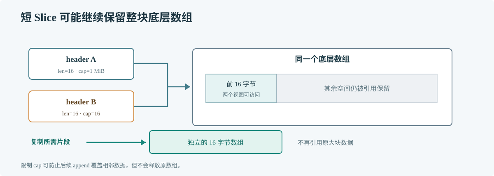

# 第 56 章 Slice 原理

## 场景

订单服务从一条很大的消息里截取请求头并交给异步审计队列。处理函数只留下几十个字节，但几小时后堆内存仍没有回落。问题不在数据量的表面长度，而在短 slice 仍引用整块底层数组。

## 问题

Slice 是一段底层数组的视图。复制 slice 只复制描述信息，不会复制元素；append 可能继续使用原数组，也可能分配新数组。只按 len 猜内存占用，容易漏掉大数组滞留和意外覆盖。

## 实现

下面比较直接截取和主动复制。截取适合临时读取；若结果要长期保存，应复制需要的数据。

> **图解**：多个 slice header 可以同时指向同一底层数组，因此修改重叠区会互相可见。短 slice 仍会保留整块数组；复制出独立小数组后，原大数组才有机会被 GC 回收。

~~~go
package main

import "fmt"

func keepHeader(payload []byte) []byte {
    if len(payload) < 16 {
        return nil
    }
    header := make([]byte, 16)
    copy(header, payload[:16])
    return header
}

func main() {
    payload := make([]byte, 1<<20)
    view := payload[:16]
    bounded := payload[:16:16]
    saved := keepHeader(payload)
    fmt.Printf("view len/cap=%d/%d\n", len(view), cap(view))
    fmt.Printf("bounded len/cap=%d/%d\n", len(bounded), cap(bounded))
    fmt.Printf("saved len/cap=%d/%d\n", len(saved), cap(saved))
}
~~~

full slice expression 只把 cap 限制为 16，防止从 bounded 继续 append 覆盖后面的数据；它依然引用原来的 1 MiB 数组。需要释放大对象时，要像 keepHeader 一样复制。

## 原理

Slice header 保存指向数组的指针、长度和容量。语言层只保证这些可观察行为，不保证每次 append 的具体扩容倍数。Go 1.23 运行时在扩容路径中会根据新长度、旧容量和元素大小选择新容量，还要处理内存对齐、清零和指针扫描；这些是实现策略，不是业务可以依赖的合同。

对不含指针的元素，GC 不必逐个扫描数组中的元素；含指针的 slice 则可能让整批对象继续存活。服务代码里，大 slice 被缩成小 view 并放进长生命周期缓存，是常见的内存保留来源。

读 Go 1.23 源码时，从 GOROOT/src/runtime/slice.go 的 growslice 和 nextslicecap 开始，观察何时需要新数组、何时保留或清零存储；不要把这些函数中的增长策略当成语言承诺。

## 最佳实践

- 已知数据量时为 make 提供合理容量，减少反复分配和复制。
- 将 slice 长期保存前确认底层数组所有权；小片段可主动复制。
- 不依赖 append 的扩容倍数来实现算法或控制内存。
- 把 slice 交给其他 goroutine 后，约定是否允许修改；必要时复制。
- 处理敏感缓冲区后按数据生命周期清理，不把复用误当成安全擦除。

## 排障

### Heap profile 显示大数组仍存活

从保留对象的引用路径向上找缓存、闭包或异步任务，检查是否保存了小切片视图。用复制后的版本做同负载对比。

### append 后原 slice 内容改变

两个 slice 很可能共享底层数组且容量足够。若调用方需要隔离结果，复制输入或使用明确的所有权转移。

### 预分配后内存反而上升

容量估计可能过大，尤其是长生命周期的大 slice。对比 allocs、in-use heap 和实际元素数量，避免为偶发峰值长期预留内存。

## 面试题

**Q1：把一个大 slice 截成很短的 slice，能否释放原数组？**

A：不能。新 slice 仍指向原数组。若要只保留小段数据，需要复制到新的底层数组。

**Q2：Slice 作为参数传递时，函数能不能修改调用方的数据？**

A：可以。参数复制的是 slice header，元素仍可能共享同一个数组；函数执行 append 时是否换数组取决于当时的容量。

## 小结

1. Slice 描述一段数组，不拥有元素的独占副本。
2. len 和 cap 影响可访问范围与 append 行为，不等于真实保留内存。
3. 长期保存小片段时，复制通常比保留大数组更省内存。
