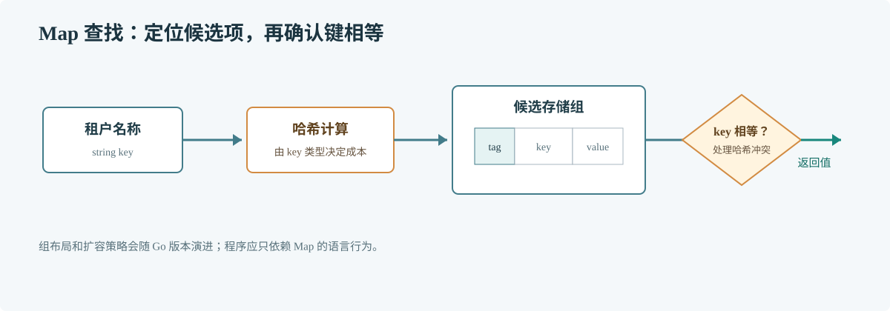

# 第 57 章 Map 原理

## 场景

网关用 map 保存租户配置，访问频繁且键值量会随租户增长。团队遇到扩容延迟、遍历顺序不稳定和并发写崩溃，需要区分哪些是语言保证，哪些是某个 Go 版本的实现细节。

## 问题

Map 的 API 看起来简单，但运行时要同时处理哈希冲突、增长、删除、迭代和并发访问。把某一版 runtime 的桶布局写进业务假设，会让升级 Go 时出现隐蔽问题。

## 实现

先看业务代码能依赖的行为：按键访问、显式检查是否存在、按预计规模预分配。下面的程序还刻意排序输出，不让 map 的遍历顺序影响接口响应。

> **图解**：Map 先根据键计算哈希，再在候选存储位置中比较控制信息和键，找到后才返回值。冲突处理与增长策略属于运行时；语言不承诺迭代顺序，也不允许无同步地并发读写。

~~~go
package main

import (
    "fmt"
    "sort"
)

func main() {
    tenants := make(map[string]string, 1000)
    tenants["north"] = "cluster-a"
    tenants["west"] = "cluster-b"

    value, ok := tenants["south"]
    if !ok {
        value = "default-cluster"
    }

    names := make([]string, 0, len(tenants))
    for name := range tenants {
        names = append(names, name)
    }
    sort.Strings(names)
    fmt.Println("south:", value)
    for _, name := range names {
        fmt.Println(name, tenants[name])
    }
}
~~~

## 原理

哈希表把键映射到候选位置，再用键相等性确认目标。哈希冲突不可避免，因此实现必须继续探测或使用其他冲突结构。增长时重新安排存储，能控制查找成本，但会消耗 CPU 和临时内存。

本机源码是 Go 1.23，使用传统 hmap/bucket 实现。Go 1.24 起运行时切换为基于 Swiss Table 的 map 实现，布局和增长细节已改变。两者都服务于相同的语言合同；不要在业务中读取私有 runtime 结构，也不要根据一次迭代顺序作决定。

对生产服务而言，Map 的性能常常取决于键的哈希成本、数据分布、分配规模和竞争方式。小型读多写少配置可由锁保护；高写并发则应先测量真实访问模式，再决定分片或其他存储。

在本机 Go 1.23 源码中，可从 GOROOT/src/runtime/map.go 的查找和增长路径，以及 map_faststr.go 的字符串键快路径开始；升级版本后先确认相应实现文件是否仍存在。

## 最佳实践

- 根据可估算的键数量预分配，但不要按最大理论值盲目分配。
- 对外输出需要稳定顺序时显式排序键。
- 并发读写时用锁、单 goroutine 所有权或经过验证的并发结构。
- 热路径避免使用昂贵且重复的复合键计算。
- 升级 Go 后重跑有代表性的 benchmark，不依赖私有布局。

## 排障

### fatal error: concurrent map read and map write

Map 本身不会自动加锁。定位所有访问路径，用同一同步边界保护读写；recover 不能把运行时并发错误变成安全行为。

### Map 扩大后延迟出现尖峰

检查增长是否与键数激增同时发生，比较预分配前后分配和延迟分布。避免提前分配过大导致常驻内存膨胀。

### 测试偶尔顺序变化

这是 map 迭代顺序未定义的体现。测试和协议输出都应显式排序，不能依赖某次运行的顺序。

## 面试题

**Q1：Go Map 为什么不是并发安全的？**

A：运行时没有为每次访问支付锁的成本，也无法推断业务需要的原子操作范围。并发访问策略应由调用方按读写模式决定。

**Q2：Go 1.23 的桶结构能否用于解释 Go 1.24 的 Map？**

A：不能把桶布局当成跨版本合同。可以讲哈希查找与冲突处理的共同目标，但具体实现要注明版本。

## 小结

1. Map 的语言行为比 runtime 布局稳定。
2. 排序、同步和容量估计都是调用方的责任。
3. 阅读实现时先确认 Go 版本，再把结论回到业务指标。
