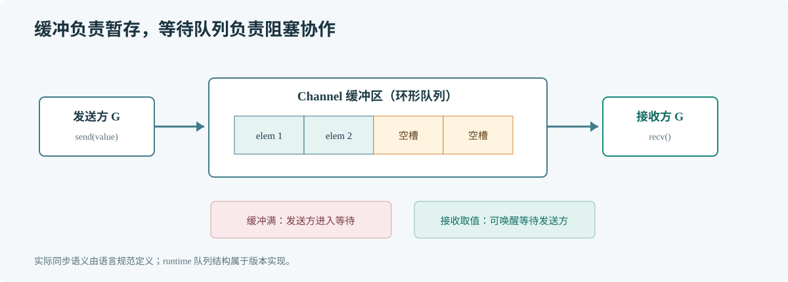

# 第 58 章 Channel 原理

## 场景

订单消费者既有批量任务，也有实时任务。调大 channel 缓冲后吞吐短暂上升，但延迟和内存逐渐变高；缩小缓冲后生产者开始等待。需要弄清楚缓冲改变的是什么，以及 Channel 还提供了什么。

## 问题

Channel 不只是队列。它还定义发送与接收的同步关系、关闭后的行为和等待方的唤醒时机。只看缓冲大小，容易把排队能力误当作处理能力。

## 实现

这段代码用一个小缓冲展示发送方最多能领先接收方多少个元素。它不改变消费者的处理速度。

> **图解**：有缓冲 Channel 在环形缓冲未满时暂存元素，满后发送者进入等待；接收方取走元素后会唤醒合适的发送者。无缓冲 Channel 没有暂存空间，发送和接收必须相遇。

~~~go
package main

import "fmt"

func main() {
    jobs := make(chan int, 2)
    jobs <- 101
    jobs <- 102
    fmt.Printf("queued=%d capacity=%d\n", len(jobs), cap(jobs))
    fmt.Println(<-jobs)
    jobs <- 103
    close(jobs)
    for job := range jobs {
        fmt.Println(job)
    }
}
~~~

## 原理

Go 1.23 的 runtime 用 Channel 状态记录缓冲区位置、等待发送者和接收者等信息。发送与接收可以直接交接，也可以经过缓冲；阻塞方会挂入等待队列，另一侧出现后被唤醒。同步关系保证发送前的数据能被对应接收方观察到。

这些结构的名字和字段不是公开 API。理解它们的价值是解释为什么缓冲容量会影响排队、为什么关闭要唤醒等待方，以及为什么向关闭 Channel 发送会 panic，而不是照着内部结构重新造一个 Channel。

本机源码入口是 GOROOT/src/runtime/chan.go：从创建、发送、接收和关闭路径分别看缓冲与等待者如何协作；阅读时只追踪能回答当前问题的分支。

## 最佳实践

- 按可接受排队量和任务内存设置缓冲，不按峰值请求数无限放大。
- 用 Context 分支让阻塞发送和接收可取消。
- 由生产者或协调者关闭；关闭代表不会再发送新值。
- 区分“队列里有工作”和“消费者处理速度足够”。
- 对任务丢弃、重试和关闭时排空的规则给出明确业务定义。

## 排障

### Channel 长期接近满载

比较入队速率和完成速率，检查消费者依赖延迟、worker 数量和失败重试。缓冲变大只会把阻塞往后推。

### 关闭时出现 panic

检查谁拥有发送权、谁负责关闭，以及是否仍有并发生产者。多个生产者应先汇合到一个明确的关闭协调者。

### goroutine 等在 channel 操作

从 goroutine profile 找到发送或接收栈，确认对侧是否会继续运行、Context 是否可取消、退出时是否仍会发送结果。

## 面试题

**Q1：缓冲 Channel 的容量应该如何选择？**

A：按允许的等待工作数、单个任务占用和延迟目标估算，再用队列长度及等待时间验证；容量不会提高消费者长期处理能力。

**Q2：Channel 的发送和接收为什么能用于同步？**

A：发送与接收之间建立 happens-before 关系，使发送前的写入在对应接收后可见。它同步的是规定的通信边界，不会自动保护通信之外的共享状态。

## 小结

1. Channel 同时承担数据传递和同步。
2. 缓冲决定有限的排队量，不决定业务吞吐上限。
3. 取消、关闭和等待方唤醒都属于生命周期设计。
