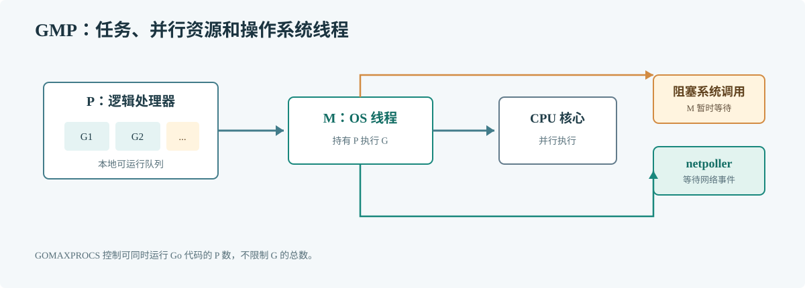

# 第 59 章 GMP 调度器

## 场景

服务扩到更多 CPU 后，goroutine 数也增加了，但吞吐没有按比例增长。CPU profile 里出现调度和锁竞争，线程数也比预想多。GMP 模型能帮助判断并发任务是在运行、等待，还是没有可用的执行资源。

## 问题

把 goroutine 当作线程，会误以为增加 goroutine 就等于增加 CPU 并行度。Go 运行时需要把可运行任务、逻辑执行资源和操作系统线程协调起来，同时处理系统调用、网络等待和抢占。

## 实现

先观察进程当前的逻辑并行度，并用一个有界任务池验证“任务数量”和“同时运行数”不是一回事。

> **图解**：G 是 goroutine，P 持有执行 Go 代码所需的调度资源，M 是操作系统线程。只有取得 P 的 M 才能执行 Go 代码；阻塞系统调用可能让 M 暂时脱离 P，运行时再安排其他可运行 G。

~~~go
package main

import (
    "fmt"
    "runtime"
    "sync"
    "sync/atomic"
)

func main() {
    var active atomic.Int64
    var peak atomic.Int64
    var wg sync.WaitGroup
    slots := make(chan struct{}, runtime.GOMAXPROCS(0))

    for job := 0; job < 1000; job++ {
        wg.Add(1)
        slots <- struct{}{}
        go func() {
            defer wg.Done()
            defer func() { <-slots }()
            now := active.Add(1)
            for old := peak.Load(); now > old && !peak.CompareAndSwap(old, now); old = peak.Load() {
            }
            // 在此处执行一个有界的 CPU 工作单元。
            active.Add(-1)
        }()
    }
    wg.Wait()
    fmt.Printf("GOMAXPROCS=%d peak-active=%d\n", runtime.GOMAXPROCS(0), peak.Load())
}
~~~

## 原理

G 保存 goroutine 的执行状态，M 承载操作系统线程，P 是可并行执行 Go 代码的逻辑处理器。调度器从本地队列取 G，必要时从全局队列或其他 P 窃取工作；网络等待通常交给 netpoller，避免每个网络等待都占住一个线程。

GOMAXPROCS 限制同时执行 Go 代码的 P 数量，不限制 goroutine 总数。默认值和容器 CPU 配额感知会随 Go 版本变化；部署中应查看目标运行时版本和实际值，不把某台开发机的数字写死为生产容量。

本机源码入口是 GOROOT/src/runtime/proc.go 的调度与找工作路径，以及 runtime/netpoll.go 的网络事件等待；用 trace 对照这些概念，比只看函数名更容易理解实际等待时间。

## 最佳实践

- CPU 密集任务按 GOMAXPROCS 和实际 CPU 配额设置并行度。
- IO 并发另设连接池和下游限额，不能只依赖 GOMAXPROCS。
- 在目标容器测量线程、调度等待和 CPU 饱和，不凭 goroutine 数判断健康度。
- 将长时间不可取消的阻塞调用隔离，并为网络与数据库操作设置 deadline。
- 使用 trace 查看 runnable、running、syscall 和 network wait 的时间分布。

## 排障

### 增加副本内 worker 后吞吐不升

检查 CPU 配额是否已满、共享锁和下游是否饱和。worker 多于可用并行度时可能只增加排队和调度开销。

### 线程数异常增加

检查是否有大量阻塞在无法由运行时识别的系统调用、cgo 或第三方库中；结合 runtime trace 和系统线程栈判断。

### CPU 不高但请求延迟高

任务可能在网络、锁、队列或定时等待。调度器不会把等待中的任务变成更快的下游响应。

## 面试题

**Q1：GOMAXPROCS 和 goroutine 数量的关系是什么？**

A：GOMAXPROCS 控制同时运行 Go 代码的 P 数量；goroutine 数可以远大于它，很多 G 会排队或等待 IO。

**Q2：网络 IO 为什么通常不会一请求占用一个固定线程？**

A：标准网络轮询器把可等待的连接交给 netpoller；有事件后再将对应 G 放回可运行队列。阻塞的系统调用仍需单独考虑。

## 小结

1. G、M、P 解决的是任务、线程和并行资源的调度关系。
2. GOMAXPROCS 控制 CPU 并行度，不是 IO 并发上限。
3. 用 trace 和服务指标确认时间花在运行、排队还是等待。
