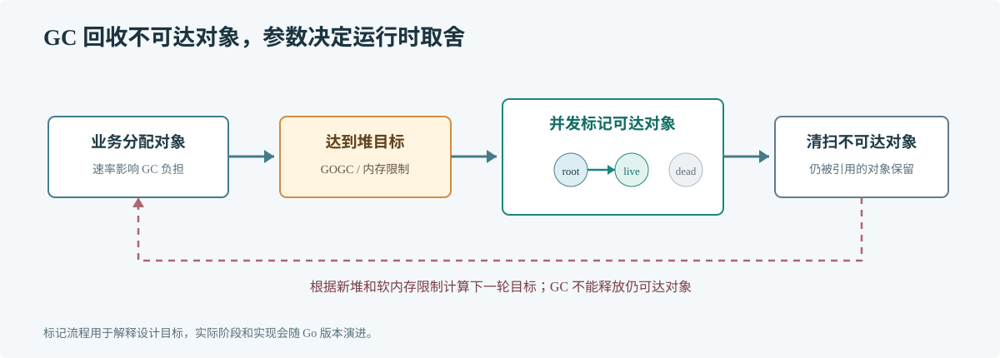

# 第 60 章 GC 原理

## 场景

促销后订单查询服务的堆内存和 GC CPU 一起升高，P99 延迟也出现周期性波动。团队不能只调大 GOGC，因为堆上对象增加可能来自缓存保留、请求分配或批处理峰值。

## 问题

GC 会回收不可达对象，但不会替程序消除不必要的分配，也不会释放仍被引用的缓存。只关注暂停时间会漏掉并发标记消耗的 CPU、堆目标和容器内存上限。

## 实现

下面展示如何读取 GC 指标以及设置进程级软内存上限。数值必须按容器 limit 留出栈、元数据、非 Go 内存和安全余量。

> **图解**：分配达到运行时计算的触发目标后，GC 并发标记仍可达对象；写屏障帮助标记期间维持对象图正确，之后清扫不可达对象。GOGC 与内存限制共同影响下一轮目标，但无法回收仍被引用的对象。

~~~go
package main

import (
    "fmt"
    "runtime"
    "runtime/debug"
    "time"
)

func main() {
    const softLimit = 512 << 20
    previous := debug.SetMemoryLimit(softLimit)
    defer debug.SetMemoryLimit(previous)

    var before, after runtime.MemStats
    runtime.ReadMemStats(&before)
    batch := make([][]byte, 256)
    for i := range batch {
        batch[i] = make([]byte, 256<<10)
    }
    runtime.ReadMemStats(&after)
    fmt.Printf("heap before=%d after=%d gc cycles=%d\n",
        before.HeapAlloc, after.HeapAlloc, after.NumGC-before.NumGC)
    runtime.KeepAlive(batch)
    time.Sleep(100 * time.Millisecond)
}
~~~

示例里的 512 MiB 是本地演示值，不应照搬到生产。若容器 limit 是 512 MiB，Go 堆的软上限通常要明显低于它，为 goroutine 栈、运行时和 C 分配保留空间。

## 原理

Go 运行时主要使用并发标记与清扫。标记阶段从根集合出发追踪仍可达对象；写屏障让并发标记期间的指针修改不会漏掉对象。运行时根据堆增长目标和内存限制安排后续 GC，部分标记工作会消耗应用可用 CPU。

GOGC 调节堆增长与回收频率的取舍；GOMEMLIMIT 或 debug.SetMemoryLimit 提供进程内存软限制。更低目标可能更早、更频繁回收；过于激进会增加 GC CPU。二者都不是泄漏修复工具。

运行时实现会迭代。阅读源码时要以部署的 Go 版本为准，并用指标验证变化，而不是把某个 GC 周期的伪代码当成永远不变的实现。

本机源码入口是 GOROOT/src/runtime/mgc.go 的启动、标记和清扫协调路径；先带着“什么条件触发下一轮、哪些工作与业务并发”两个问题阅读。

## 最佳实践

- 先用 heap profile 找出分配热点和长生命周期引用，再调 GC 参数。
- 为缓存设置容量、过期和淘汰策略；确认对象可达路径符合业务需要。
- 容器内存配置给非堆内存留余量，结合 RSS 与 Go heap 指标观察。
- 对高分配热路径用 benchmark 和 CPU/heap profile 评估优化。
- 通过运行时指标观察堆目标、GC CPU、暂停时间和分配速率。

## 排障

### GC CPU 高

查看分配速率、对象大小和存活堆；先减少无效分配或引用，再评估 GOGC 和容器限制。

### GC 后内存不下降

GC 只回收不可达对象。用 heap profile 的 in-use 对象和引用路径检查缓存、全局变量、闭包或仍在运行的任务。

### 容器 OOM 但 Go heap 未到上限

检查 goroutine 栈、内存映射、cgo 或 native 库分配，以及配置的软限制是否高于容器实际余量。

## 面试题

**Q1：调低 GOGC 是否能修复内存泄漏？**

A：不能。它可能让回收更频繁，但仍可达对象不会被释放，还会增加 GC CPU。

**Q2：为什么设置内存软限制不能等同于容器 limit？**

A：运行时软限制不覆盖所有进程内存；还要给栈、运行时元数据、映射文件和非 Go 分配留空间。

## 小结

1. GC 管理不可达对象，不替程序决定对象应该活多久。
2. 分配速率、存活堆、CPU 与容器 RSS 要一起看。
3. 参数调整要在目标 Go 版本和容器配额下验证。
