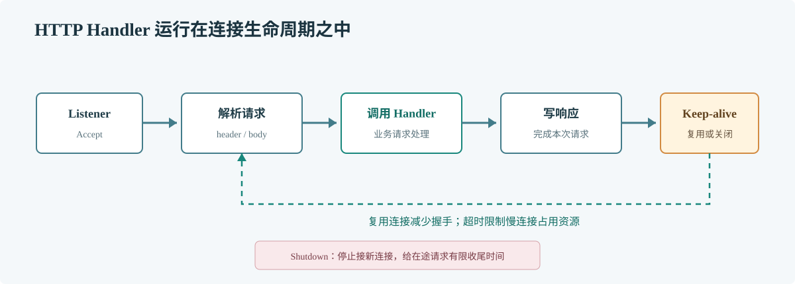

# 第 61 章 net/http 源码

## 场景

订单 API 在流量高峰出现连接数激增、慢客户端占用 goroutine 和下游连接复用率低。团队需要理解标准库服务器与客户端的连接生命周期，避免把一个请求处理函数当成整个 HTTP 服务。

## 问题

HTTP 服务不仅是路由分发。服务器还负责接受连接、解析请求、调用 Handler、写响应和处理 keep-alive；客户端 Transport 管连接池、复用与超时。没有期限和连接复用策略时，慢连接会长期占用资源。

## 实现

使用显式 Server 超时、请求大小限制和优雅关闭。健康端点只返回服务状态，不泄露内部配置。

> **图解**：Listener 接受连接后，Server 解析请求并调用 Handler；响应结束后，连接可能进入 keep-alive 等待下一次请求。ReadHeaderTimeout 限制请求头读取时间，IdleTimeout 限制空闲连接驻留，Shutdown 则停止接收新请求并等待在途处理完成。

~~~go
package main

import (
    "context"
    "encoding/json"
    "errors"
    "log"
    "net/http"
    "os"
    "os/signal"
    "syscall"
    "time"
)

func main() {
    mux := http.NewServeMux()
    mux.HandleFunc("/healthz", func(w http.ResponseWriter, r *http.Request) {
        if r.Method != http.MethodGet {
            http.Error(w, "method not allowed", http.StatusMethodNotAllowed)
            return
        }
        w.WriteHeader(http.StatusOK)
        _, _ = w.Write([]byte("ok\n"))
    })
    mux.HandleFunc("/v1/orders", func(w http.ResponseWriter, r *http.Request) {
        r.Body = http.MaxBytesReader(w, r.Body, 1<<20)
        var order map[string]any
        if err := json.NewDecoder(r.Body).Decode(&order); err != nil {
            var tooLarge *http.MaxBytesError
            if errors.As(err, &tooLarge) {
                http.Error(w, "request body too large", http.StatusRequestEntityTooLarge)
            } else {
                http.Error(w, "invalid JSON body", http.StatusBadRequest)
            }
            return
        }
        w.WriteHeader(http.StatusAccepted)
        _, _ = w.Write([]byte("accepted\n"))
    })

    server := &http.Server{
        Addr:              ":8080",
        Handler:           mux,
        ReadHeaderTimeout: 5 * time.Second,
        ReadTimeout:       15 * time.Second,
        WriteTimeout:      20 * time.Second,
        IdleTimeout:       60 * time.Second,
        MaxHeaderBytes:    1 << 20,
    }
    ctx, stop := signal.NotifyContext(context.Background(), os.Interrupt, syscall.SIGTERM)
    defer stop()
    go func() {
        if err := server.ListenAndServe(); err != nil && !errors.Is(err, http.ErrServerClosed) {
            log.Printf("http server failed: %v", err)
            stop()
        }
    }()
    <-ctx.Done()

    shutdownCtx, cancel := context.WithTimeout(context.Background(), 10*time.Second)
    defer cancel()
    if err := server.Shutdown(shutdownCtx); err != nil {
        log.Printf("graceful shutdown failed: %v", err)
        _ = server.Close()
    }
}
~~~

## 原理

Go 1.23 的 Server 将监听、连接处理和 Handler 调用拆开管理；一个连接可以承载多个顺序请求。Transport 维护到目标主机的空闲连接并优先复用，因此应复用 http.Client 和 Transport，而不是每个请求新建一份。

源码值得关注的是资源边界：连接何时被复用或关闭，请求体何时需要读完或关闭，超时作用于哪个阶段，Shutdown 如何等待在途请求。业务 Handler 仍应专注于请求语义，不应自己复制标准库的连接管理。

Go 1.23 的阅读入口是 GOROOT/src/net/http/server.go 的 Serve 与连接处理路径，以及 transport.go 的连接获取和复用路径；结合本章的超时配置逐项追踪资源何时释放。

## 最佳实践

- 配置 ReadHeaderTimeout、IdleTimeout 和合适的读写超时。
- 复用 http.Client；读取响应后关闭 Body，保持 Transport 可复用。
- 限制请求体大小，并对上传和长轮询设置不同策略。
- Shutdown 设置有上限的等待时间；超时后按策略强制关闭。
- 用反向代理、服务端超时和下游 deadline 组成完整请求预算。
- 生产诊断接口与业务监听分开，并限制访问。

## 排障

### goroutine 卡在读请求头

确认 ReadHeaderTimeout 是否生效，检查代理是否发送不完整请求，以及连接是否绕过预期入口。

### 客户端连接数持续增加

确认响应 Body 是否关闭、Client/Transport 是否被重复创建、IdleConn 配置是否符合并发量。

### 发布时请求被中断

确认进程收到退出信号、负载均衡先摘除实例、Shutdown 等待窗口足够，并检查长请求是否有自己的 deadline。

## 面试题

**Q1：为什么应该复用 http.Client？**

A：Client 使用 Transport 管理连接池。复用它能复用 keep-alive 连接，减少握手和连接建立开销。

**Q2：Server.Shutdown 和 Close 有什么区别？**

A：Shutdown 停止接受新连接并等待活动请求结束，受 Context 限制；Close 更直接地关闭连接，适合作为超时后的强制收尾。

## 小结

1. net/http 管理的不只是路由，还包括连接、超时与资源收尾。
2. 服务端配置阶段性超时，客户端复用 Transport 并关闭响应体。
3. 阅读源码要围绕连接生命周期和资源边界，而不是逐函数翻译。
