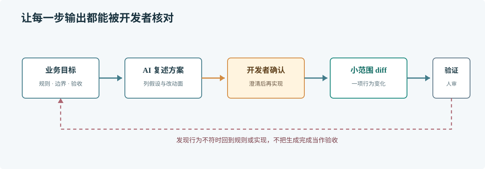

# 第 62 章 AI 开发工作流

## 场景

订单组接到一个小需求：会员订单满 300 元免运费。开发者把一句话发给 AI，几分钟后拿到一套新的定价模块、缓存和配置中心；代码看起来齐全，却没有说明 300 元是含优惠前还是优惠后金额。

## 问题

AI 缺少仓库约定和业务事实时，会用常见做法补空白。输出越长，不代表越符合当前代码。把含糊需求一次性变成大批代码，评审者还要花时间区分真正需要的改动和模型自行扩展的部分。

## 实现

把一次任务拆成可核对的输入、窄范围修改和验证证据。先给 AI 读相关代码和约束，确认它复述的业务规则，再让它围绕一个验收点给出变更。

> **图解**：开发者先提供目标、仓库约定和不确定项，AI 先整理方案与风险，开发者确认后才修改代码；最终由构建、测试和人工审查判断结果是否可接受。

下面的请求把关键上下文写在前面：

~~~text
目标：会员订单满 300 元免运费。
金额口径：使用优惠券和积分抵扣后的商品实付金额，不含运费。
本次范围：只修改 internal/pricing 中的运费计算；不改 API、数据库和配置格式。
仓库约定：金额用分的 int64 表示；现有函数错误码保持不变。
验收：普通用户始终收取 12 元；会员实付 29999 分收 12 元；实付 30000 分及以上免运费。
先检查相关代码并列出需要确认的假设和拟改文件，暂时不要修改。
~~~

确认规则后，再要求它实现并报告改动文件、边界情况和实际执行过的命令。提交前自己看 diff，尤其检查新增依赖、导出 API、错误处理和未要求的重构。

## 原理

AI 根据输入生成候选内容，不会自动知道某项业务约定是否仍然有效。明确规则和范围会缩小补全空间；分步交付则让错误尽早暴露在小 diff 中。

上下文有容量和敏感数据边界。只提供解决问题所需的代码与配置，不把生产密钥、用户数据或无关仓库内容发给外部服务。大任务要切成可独立评审的提交，而不是不断追加指令直到对话历史无法复核。

## 最佳实践

- 先问清验收条件，再请求改代码；未知规则应列为问题，不让 AI 猜。
- 把目录、命名、错误处理和依赖限制写入任务上下文。
- 一次围绕一个可验证目标修改，限制文件和行为范围。
- 要求 AI 说明使用的假设、修改文件和没有验证的部分。
- 由开发者执行构建与测试并检查 diff，不接受“已验证”但没有命令或输出的结论。
- 对凭证、客户数据和内部机密按组织策略处理。

## 排障

### AI 生成了大量不相关代码

把任务缩到一个文件或一个行为，提供现有相邻实现作为参照，并明确本次不改的边界。

### 生成结果反复改变

检查需求是否有冲突、对话上下文是否混杂不同任务。固定验收条件后重新开始一个窄任务，并让它先复述理解。

### 代码看起来合理但业务不对

回到实际业务规则和调用方数据，补充能区分不同解释的边界案例。语言模型不能替代产品或领域事实的确认。

## 面试题

**Q1：怎样让 AI 生成的改动更容易评审？**

A：提供清楚验收条件和仓库约束，控制修改范围，要求说明假设和影响，再由开发者检查 diff 与验证输出。

**Q2：AI 说测试通过，能否直接合并？**

A：不能。要看实际执行的命令、运行环境和结果，并确认测试覆盖了本次改动对应的行为。

## 小结

1. AI 适合提供候选方案和代码，业务事实由团队确认。
2. 小范围改动和明确验收能降低评审成本。
3. 合并依据是可复核的 diff 与验证证据，不是生成速度。
