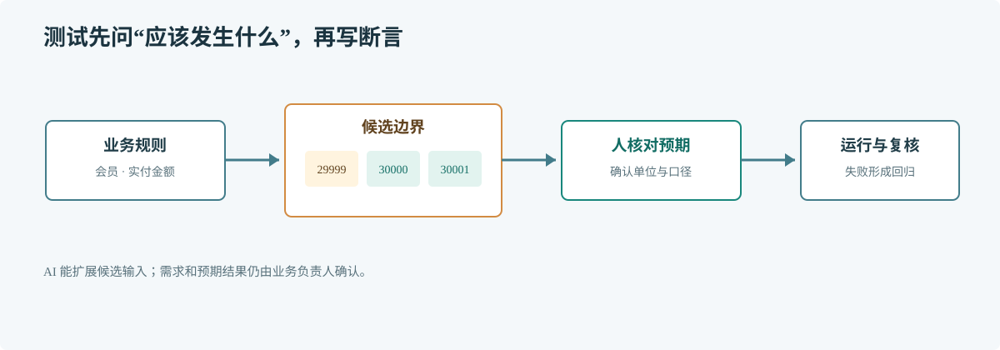

# 第 63 章 AI 生成测试

## 场景

订单上线了会员免运费规则。手工测试覆盖了普通订单和会员订单，但没有测金额刚好达到门槛的情况。开发者可以让 AI 根据明确的行为契约补候选用例，再逐项确认预期值。

## 问题

只把实现代码交给 AI，它容易复制当前实现的错误；只给一句“多测点边界”，又无法判断业务期望。测试应该从可观察行为出发，而不是试图覆盖每一行代码。

## 实现

先定义金额单位和免运费条件，再用表驱动测试覆盖门槛两侧、角色差异和零值。

> **图解**：需求先转换为输入条件和明确期望，再由 AI 提议边界与异常用例；开发者确认每个预期后才把用例放入测试套件，失败时先判断是代码错误还是契约未写清。

shipping.go：

~~~go
package pricing

type Order struct {
    PaidCents int64
    Member    bool
}

func ShippingFee(order Order) int64 {
    const thresholdCents = 30000
    const standardFeeCents = 1200
    if order.Member && order.PaidCents >= thresholdCents {
        return 0
    }
    return standardFeeCents
}
~~~

shipping_test.go：

~~~go
package pricing

import "testing"

func TestShippingFee(t *testing.T) {
    cases := []struct {
        name  string
        order Order
        want  int64
    }{
        {name: "ordinary order", order: Order{PaidCents: 50000}, want: 1200},
        {name: "member below threshold", order: Order{PaidCents: 29999, Member: true}, want: 1200},
        {name: "member at threshold", order: Order{PaidCents: 30000, Member: true}, want: 0},
        {name: "member above threshold", order: Order{PaidCents: 30001, Member: true}, want: 0},
        {name: "zero payment", order: Order{Member: true}, want: 1200},
    }

    for _, tc := range cases {
        t.Run(tc.name, func(t *testing.T) {
            if got := ShippingFee(tc.order); got != tc.want {
                t.Fatalf("ShippingFee(%+v) = %d, want %d", tc.order, got, tc.want)
            }
        })
    }
}
~~~

将两个文件放在同一个 Go 包后运行 go test ./...。让 AI 提议测试时，可要求它逐行列出“规则、输入、预期结果”，先审预期，再接受代码。

## 原理

一个高价值用例能区分正确行为与常见错误。对门槛规则，测试 29999、30000 和 30001 分能发现大于与大于等于的差异；普通用户用例能发现会员条件被遗漏。

AI 能快速提出组合，但不会天然知道金额是分还是元，也不知道优惠叠加顺序。测试价值取决于契约是否可信，而不是用例数量或覆盖率数字。

## 最佳实践

- 先写行为表，再让 AI 转换为测试代码。
- 对金额、时间、排序和权限等规则明确单位、时区与边界。
- 优先测试公开行为和错误结果，避免绑定私有实现细节。
- 使用确定性输入，隔离时钟、随机数、网络和共享状态。
- 检查 AI 是否生成了无意义断言、重复用例或只验证 mock 调用。

## 排障

### AI 生成的测试总是通过

检查断言是否真的比较业务结果，是否把期望值从被测函数重新计算，以及测试数据是否触发了目标分支。

### 同一个需求有多个预期答案

先让业务负责人确认口径。若规则存在配置差异，把配置条件和每种配置对应的结果写进契约。

### 测试通过但生产问题仍发生

对照真实故障输入、配置和并发条件补回归用例；如果问题出现在数据库或网络边界，应增加相应集成测试，而不只扩充纯函数测试。

## 面试题

**Q1：AI 生成测试应该从实现还是需求开始？**

A：以已确认的需求契约为准。实现只能帮助找分支和候选边界，不能作为预期行为的权威来源。

**Q2：测试覆盖率高是否代表测试质量高？**

A：不代表。覆盖率显示代码是否被执行，不显示断言能否发现业务错误。

## 小结

1. 测试输入和预期必须来自明确的行为规则。
2. AI 擅长扩展候选边界，人负责确认业务含义。
3. 用故障输入补回归测试，比单纯追求覆盖率更有效。
