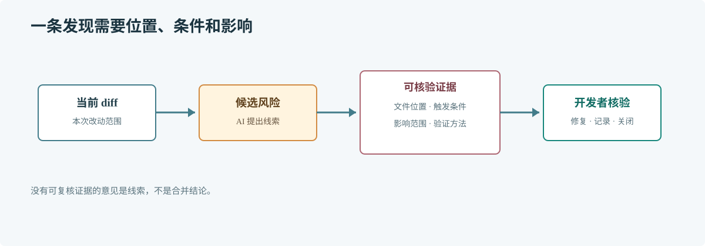

# 第 64 章 AI 代码审查

## 场景

用户服务新增登录失败日志。合并请求只改了几行，日志调用却把完整 Authorization header 写入日志平台。人工评审关注了错误码和格式，没有注意到凭证泄露。

## 问题

AI 可以快速扫描重复模式和危险边界，但也会报告不存在的问题、误解业务语义，或把个人偏好包装成缺陷。审查输出必须有代码位置和可复现理由，不能以“模型说有风险”为结论。

## 实现

让 AI 只审查当前 diff，并按风险格式提交证据。示例请求：

> **图解**：审查从变更 diff 出发，逐条关联具体代码和业务影响；开发者核验命中是否成立，必要时运行命令或追踪调用方，再决定修复、记录或关闭。

~~~text
只审查当前 diff，不重写代码。优先检查：
1. 认证凭证、个人数据是否进入日志或错误响应。
2. 并发共享状态和资源是否在所有退出路径释放。
3. 数据库、HTTP 和 RPC 调用是否有超时与错误处理。
4. 输入验证是否在信任边界执行。

每条发现必须包含：严重度、文件与行、触发条件、实际影响、建议验证方式。
不要报告纯风格偏好；找不到有证据的问题时明确写“未发现确认的问题”，并注明未覆盖的运行行为。
~~~

每条发现都要回到 diff 和调用链确认。比如只有在确实把凭证变量传给 logger 的路径上，日志泄露才成立；如果只是字段名相似，应该关闭该发现。

## 原理

代码审查是基于上下文的风险判断，不是规则匹配。模型能指出可疑模式，却通常无法访问完整生产拓扑、权限配置和运行数据，因此报告只是待核验线索。

输出中带文件行号能缩短复核路径；触发条件和影响则帮助评估严重程度。缺少其中任一项的发现通常不适合直接阻塞合并。

## 最佳实践

- 先确认 AI 看到的是目标分支相对当前分支的真实 diff。
- 要求发现对应代码和触发条件，不采纳纯猜测或格式意见。
- 先处理安全、数据损坏、死锁、资源泄漏和兼容性风险。
- 将重复出现的有效发现转成静态检查、测试或团队规范。
- 对未运行的代码路径注明不确定性，不把“未发现”解释为“没有风险”。

## 排障

### 审查报告有很多误报

缩小 diff 和检查范围，补充调用方、数据形状与错误策略；把偏好性建议从阻断项中排除。

### 报告指向错误行

确认工具使用的是最新 diff，要求给出符号或代码片段而不只给行号，再由开发者定位当前版本。

### AI 没发现明显问题

确认输入包含全部相关文件和配置。敏感路径仍需安全扫描、权限检查和人工评审，不能用一次模型审查替代专门工具。

## 面试题

**Q1：AI 代码审查发现的问题应如何进入合并流程？**

A：作为有证据的候选发现，由开发者核验触发路径、影响和修复方式，再按团队严重度规则决定是否阻断。

**Q2：AI 没有发现问题意味着代码安全了吗？**

A：不意味着。输入范围、模型能力和运行环境都有限，安全结论仍需要专门检查和责任人确认。

## 小结

1. 审查意见要能追到代码、触发条件和实际影响。
2. AI 是快速的第二双眼睛，不是合并审批人。
3. 把已确认的重复问题沉淀为自动化防线。
