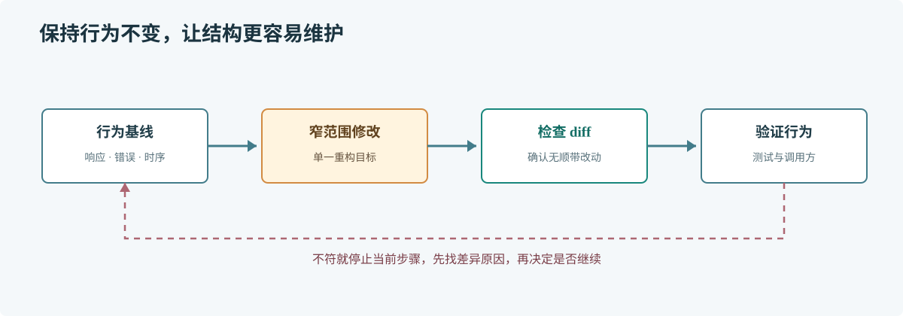

# 第 65 章 AI 辅助重构

## 场景

库存服务有三处相同的重试循环。准备把它们提取为公共函数，但线上接口的重试次数、退避和错误返回已经是兼容行为，不能趁重构改变。

## 问题

重构改变代码结构，不应改变可观察行为。AI 可能顺手统一错误类型、调整默认值或新增抽象，让 diff 看起来更整洁，却超出本次目标。

## 实现

先把行为写成清单，再限定重构范围。下面的例子提取重试判断，但保留每个调用方的次数和错误。

> **图解**：先记录输入输出、重试次数和错误语义作为基线，再做小步结构调整；每一步检查 diff 并运行既有验证，发现行为变化就回退这一步，而不是继续叠加修改。

重构前的关键约束：

~~~text
目标：减少重复的重试控制代码。
保持不变：最大调用次数、调用间隔、最后一次错误、Context 取消语义和日志字段。
本次不做：改错误类型、换重试库、改公共 API、优化其他目录。
请先指出重复代码和差异，再给出最小提取方案；确认前不要修改。
~~~

可提取的纯决策函数如下：

~~~go
package retry

import "time"

func nextDelay(attempt, maxAttempts int, base time.Duration) (time.Duration, bool) {
    if attempt >= maxAttempts {
        return 0, false
    }
    return time.Duration(attempt) * base, true
}
~~~

调用方仍负责等待、Context 取消和原错误传播；提取决策函数并不等于把整个重试策略隐藏到通用框架里。

## 原理

重构安全性来自行为基线，而不是 diff 行数少。接口响应、错误、调用次数、日志和时序都可能被依赖；如果没有测试和可观察记录，就无法判断“只改结构”是否成立。

把纯决策与副作用分开，通常能让重构边界更清楚。AI 可识别重复片段并建议抽象，但抽象是否匹配业务语义仍要由维护者判断。

## 最佳实践

- 先确认基线测试和当前行为，补上缺失的边界用例。
- 一次只重构一个概念，保留行为变化的可追踪性。
- 明确禁止顺带修改的 API、依赖和配置。
- 看 diff 是否扩大了可见面、错误面或分配热点。
- 验证失败时先撤销最近一步并定位原因，不继续叠加补丁。

## 排障

### 重构后测试通过但线上行为不同

检查测试未覆盖的错误、时序、重试次数和日志字段；将真实差异转成回归案例。

### AI 反复建议抽象层

要求它比较调用方差异和未来维护成本。只有重复确实共享同一策略时才提取。

### Diff 很难评审

拆分纯移动、格式化和行为修改。一次提交保留一个可说明的变化。

## 面试题

**Q1：怎样判断这次是重构而不是功能变更？**

A：比较前后可观察行为，包括返回值、错误、外部调用、时序和资源使用，并由测试或监控证据支撑。

**Q2：为什么不把所有重复代码都抽成公共函数？**

A：表面相似不代表业务规则相同。抽象会扩大耦合面，后续差异可能迫使函数加入复杂参数。

## 小结

1. 先写行为基线，再让 AI 处理结构。
2. 限定文件和不变条件，保持 diff 容易复核。
3. 抽象要表达共同业务规则，而不只是相似代码形状。
