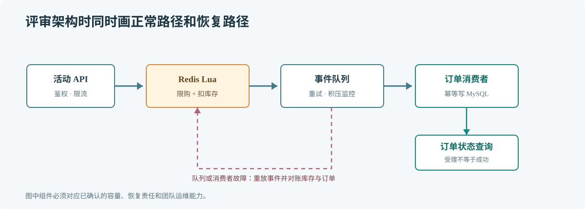

# 第 66 章 AI 辅助架构设计

## 场景

业务团队要在两个月内上线限量活动：库存 5000 件，活动开始时峰值预计 2 万请求每秒；下单需要防超卖、按用户限购，并能在库存服务短暂故障后恢复订单结果。

## 问题

只给 AI 一句“设计秒杀架构”，它可能列出 Kafka、Redis、Kubernetes 和多层缓存，却没有说明这些组件分别解决哪个约束。架构决策需要业务不变量、容量预算、失败行为和团队运维能力。

## 实现

先提供已知约束和未知项，要求给出两种方案、代价和故障行为。确认关键决策后再画流程，并把决策记入 ADR。

> **图解**：入口先限流和识别重复请求，库存由一个共享原子边界扣减，成功请求进入持久化消费路径；消费者以幂等约束写订单。设计评审还需明确 Redis 或消费者故障时如何恢复，而不是只看正常箭头。

~~~text
业务不变量：
- 总成功订单不能超过活动库存。
- 同一用户对同一活动最多成功一次。
- 接口快速返回受理结果；最终订单状态可查询。

已知容量：
- 峰值入口约 20000 请求/秒，活动库存 5000。
- 当前团队维护 Redis、MySQL 和 Kafka；没有专职平台团队。

请比较两种不引入新数据库的方案。对每种方案说明：
1. 库存扣减与消息写入是否处于同一个原子边界。
2. 重试和重复消费如何保持幂等。
3. Redis、Kafka 或 MySQL 故障时会发生什么。
4. 如何恢复未完成请求和核对库存。
先列未知项，不要把未确认的数字当成事实。
~~~

一份可评审的 ADR 至少记录背景、约束、候选方案、选择理由、失败场景、回滚办法和后续验证。AI 的图和说明只是讨论材料，团队要确认每个箭头对应真实接口和可执行操作。

## 原理

架构设计是在约束下选择故障边界和成本。排队削峰能缓冲突发，但会增加排队延迟和待恢复状态；原子扣库存能保证库存边界，但不能自动保证订单落库；幂等消费可以处理重复消息，但需要稳定业务键和持久化约束。

AI 适合展开候选方案、列出遗漏问题和比较影响。它无法替团队确认实际流量分布、SLO、供应商故障策略或运维能力，这些信息要通过数据和责任人补齐。

## 最佳实践

- 将业务不变量和峰值量化，不只给组件清单。
- 为关键故障写出用户看到什么、数据如何恢复和由谁操作。
- 比较方案的延迟、成本、复杂度和运维负担。
- 先用 ADR 记录选择，再用压测、故障演练和数据核对验证。
- 让 AI 标出假设和未知项；未经确认的假设不能成为生产决策。

## 排障

### 方案包含太多基础设施

逐项追问组件对应的约束、现有能力和删除后果。没有明确收益的组件先不纳入首版。

### 图看起来完整但无法落地

检查每条箭头是否对应接口、数据格式、超时、重试和负责人；没有这些信息的图仍是概念草图。

### 容量估算与压测差距很大

回看请求构成、热点键、重试放大、数据倾斜和连接池上限，修正假设后再比较方案。

## 面试题

**Q1：AI 给出架构图后还需要哪些验证？**

A：核实业务不变量、容量和故障行为，做关键路径压测与失败演练，并确认运维团队能观察和恢复状态。

**Q2：为什么要让 AI 列未知项？**

A：未确认事实会被模型用常见模式补齐。把未知显式列出，团队就能决定先测量、先询问还是按保守假设设计。

## 小结

1. 架构输入先写约束、不变量、峰值和团队能力。
2. 方案要解释失败和恢复，不止展示正常数据流。
3. AI 帮助比较选项，最终决策由掌握业务与运行责任的团队作出。
