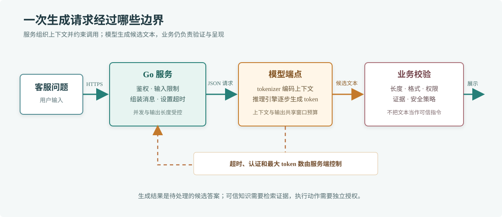

# 第 67 章 LLM 基础

## 场景

公司准备给客服后台增加内部知识问答。客服输入“订单被取消后，优惠券会退回来吗”，服务需要把问题发给模型，再把答案展示给客服。上线前要先分清两件事：模型能生成流畅文字，不代表它知道公司的最新规则；服务能请求到模型，也不代表请求成本、超时和敏感数据已经受控。

## 问题

第一次接入时常见三种误判：把模型当成普通确定性函数、把模型参数量当成效果保证、把一段聊天记录无限累积进请求。结果可能是答案编造政策、请求越来越慢，或者内部数据被发到未经批准的服务。

本章先做一次普通文本生成调用。知识检索、工具调用、Agent 和 MCP 会在后续章节分别展开，不把它们混进最小调用链。

## 实现

先把用户输入限制在可接受范围，给模型明确的任务说明，并为网络请求设置超时和响应体上限。示例使用 OpenAI 兼容的 Chat Completions 请求格式，默认连本地 Ollama；其他服务只有在兼容相同字段和响应格式时才能直接复用。



> **图解**：请求从 Go 服务进入模型接口，服务把系统规则和用户问题组合成消息；模型根据上下文生成 token，响应返回服务后还要经过长度检查和业务校验才能展示。模型只负责生成候选文本，箭头不会绕过服务端的超时、权限和内容处理。

示例源码：[`67-llm-basics/main.go`](./67-llm-basics/main.go)。使用 Ollama 时，先启动本地服务并拉取一个模型：

```bash
ollama pull qwen2.5:3b
```

在示例目录运行：

```bash
LLM_MODEL=qwen2.5:3b go run .
```

默认请求地址为 `http://localhost:11434/v1/chat/completions`。接入其他 OpenAI 兼容服务时设置完整 URL 和 API Key：

```bash
LLM_ENDPOINT=https://your-llm.example.com/v1/chat/completions \
LLM_MODEL=your-model \
LLM_API_KEY=your-key \
go run .
```

不要把真实密钥写进代码、命令历史或提交记录；线上应由 Secret 或密钥服务注入。服务端不能把模型输出直接当作 SQL、Shell 命令或权限决策。

## 原理

LLM（Large Language Model，大语言模型）根据输入上下文逐步预测后续 token。Token 是模型处理文本的单位，可能是一个字、词的一部分、标点或空格；它不等同于汉字数，也不等同于 Go 字符串长度。

一次生成通常经过以下步骤：服务组织消息，模型侧 tokenizer 把文本映射成 token，推理引擎依据模型权重计算下一个 token 的概率，再按解码策略选出 token 并继续生成，直到达到停止条件或长度上限。模型权重是训练得到的参数；上下文是本次请求提供的信息；解码参数影响输出方式。这三者不是同一件事。

`temperature` 等采样参数会改变候选 token 的选择倾向，但调低 temperature 不会让模型自动获得事实依据。模型可能利用训练时学到的模式补全答案，也可能在缺少证据时生成看似合理的内容。客服知识库应在 RAG 中把已审核的资料检索出来，再要求模型依据资料回答。

上下文窗口限制一次请求中可处理的输入和输出总量。历史对话、系统提示、检索片段和回答都会占用窗口；长上下文通常也会增加传输量、推理延迟和费用。不能把整个数据库或无限聊天记录直接塞进 Prompt。

## 最佳实践

- 按业务数据等级选择模型服务，确认数据是否会被留存、用于训练，以及服务部署区域是否合规。
- 设定请求超时、输入大小、最大输出长度和并发上限；对 429、超时和 5xx 设计有界重试与退避。
- 保存模型名、请求耗时、token 用量、状态码和请求关联 ID；日志中避免记录密钥和未脱敏的用户原文。
- 把模型答案视为不可信输入。展示前按业务要求校验、过滤或要求人工确认。
- 用真实问题集评估正确性、拒答能力、延迟与成本；仅看一两次演示无法代表线上质量。
- 通过配置切换模型和地址，保留一组稳定评测样例，升级模型时先比较再发布。

## 排障

### 请求超时

检查服务到模型端点的网络、模型是否已加载、输入上下文长度和服务端并发。先用短问题复现，再确认超时预算是否大于模型的正常生成时长；不要通过无限延长超时掩盖排队问题。

### 返回 401 或 403

核对端点要求的认证方式、API Key 注入路径和模型访问权限。不要把密钥打印到日志中；在本地用环境变量验证后，再检查部署环境的 Secret 是否挂载到正确进程。

### JSON 解析失败或没有候选答案

检查请求 URL 是否指向兼容接口、服务是否返回了 HTML 错误页、响应是否超过客户端限制，以及所选模型名称是否存在。不同厂商的兼容接口并非完全一致，遇到差异时按该服务的接口文档调整适配层。

### 答案流畅但事实错误

这是生成模型的能力边界，不是重试就能修好的网络故障。把可验证的业务资料加入检索上下文，要求模型引用证据；证据缺失时应允许它明确表示不知道。

## 面试题

**Q1：为什么 temperature 为 0 仍不能保证答案正确？**

A：temperature 影响采样随机性，不会补充事实来源，也不会改变模型对训练分布的局限。确定性地生成同一个错误答案，仍然是错误答案。

**Q2：上下文窗口越大越好吗？**

A：更大的窗口能容纳更多输入，但会带来更多计算、延迟和费用，也不保证模型能同等准确地使用所有内容。应优先检索与问题相关的资料并控制输入长度。

**Q3：模型 API 返回 200，是否说明业务请求成功？**

A：只说明 HTTP 调用成功。服务仍要处理空回答、内容安全、业务约束、引用证据和用户权限，并记录可排查的调用指标。

## 小结

1. LLM 根据上下文生成候选文本，流畅度不等于事实可靠。
2. Go 服务负责认证、超时、限流、数据边界和输出处理。
3. 上下文、采样、长度和模型选择共同影响质量、延迟与成本。
4. 内部知识问答需要后续的检索与证据校验，不能只靠模型记忆。
