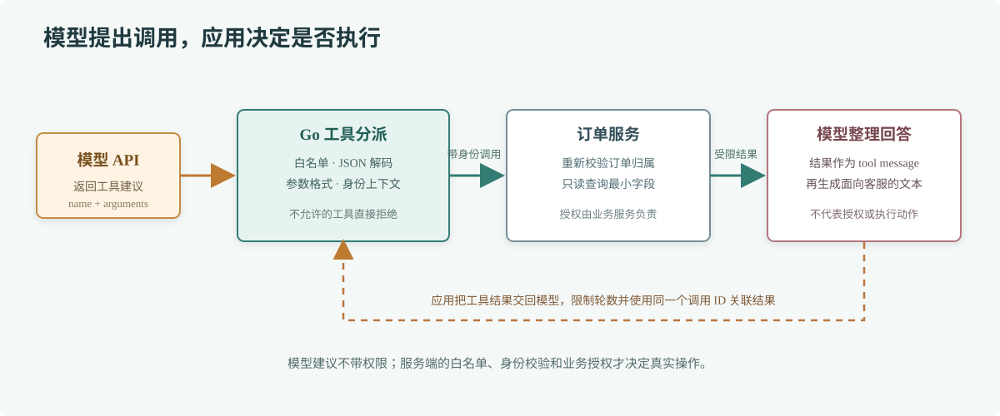

# 第 69 章 Function Calling

## 场景

客服问“ORD-104288 的订单现在到哪一步了”。模型本身看不到订单数据库。服务可以把一个只读的 `get_order_status` 工具描述交给模型，让模型判断何时需要查单；真正访问订单服务的仍是 Go 代码。

## 问题

把工具调用理解成“模型直接执行函数”会造成严重的权限误区。模型返回的函数名和参数都可能错误或被用户输入影响。若服务接受任意函数名、任意 URL 或未校验的订单号，语言模型就会变成一个缺少边界的代理。

## 实现

使用明确的工具声明描述函数名、用途和参数 schema。收到模型返回的 `tool_calls` 后，服务只匹配本地白名单，再校验参数、身份和业务权限；执行结果作为 tool message 放回对话，让模型整理成面向客服的回答。



> **图解**：模型只返回工具名称和 JSON 参数建议。Go 服务检查工具白名单与参数，再携带已认证的客服身份访问订单服务；结果回到模型后用于组织回答。模型无法跳过服务端直接读取数据库或决定授权。

示例源码：[`69-function-calling/main.go`](./69-function-calling/main.go)。本地运行还需要一个实现内部查单接口的订单服务；服务地址、模型端点和调用身份都由环境变量提供：

```bash
cd 69-function-calling
ORDER_SERVICE_URL=http://localhost:8081/internal/orders \
CALLER_USER_ID=staff-42 \
LLM_MODEL=qwen2.5:3b \
go run . -question 'ORD-104288 现在是什么状态？'
```

高风险动作（退款、改价、取消订单）不应作为可自动执行的工具。本章示例只读订单状态；需要写操作时还要做服务端授权、幂等、防重放和必要的人为确认。

## 原理

Function Calling 不是模型在服务器进程里调用 Go 函数，而是模型 API 返回一个结构化的调用请求。应用收到请求后负责解析、授权、执行，再把结果交回模型。工具 schema 帮助模型生成更符合预期的参数，但它不是后端输入验证。

一次调用至少包含两次模型交互：第一轮决定是否请求工具，应用执行工具后再发送结果，模型才能生成最终文本。工具链越长，延迟和失败点越多，因此要限制工具数量、单轮调用数和总时间。模型返回的自由文本不能代替 API 响应里的工具调用字段。

## 最佳实践

- 工具只暴露完成任务所需的最小能力，优先提供只读、窄参数接口。
- 工具名称使用白名单分派；参数使用强类型结构解码，并校验长度、格式、枚举和资源归属。
- 身份和权限从认证中间件或可信调用上下文取得，不能使用模型生成的用户 ID。
- 工具调用设置 deadline、响应体上限、并发限制和调用次数上限；超时后不要无限重试。
- 工具结果只返回模型回答需要的字段，过滤凭证、内部备注和其他客户数据。
- 对写操作做幂等和审计；涉及资金或不可逆变化时要求独立授权或人工确认。
- 记录 tool name、耗时、结果码和 trace ID，不把完整敏感参数写入普通日志。

## 排障

### 模型没有返回工具调用

检查当前模型是否支持工具调用、请求是否带上 `tools`、schema 是否过于复杂，以及问题是否足以让模型判断需要查询。不要在模型拒绝调用时自动执行一个猜测出来的工具。

### 返回了未知工具名

白名单分派应拒绝它并记下模型与请求 ID。不要用反射、Shell 或动态 URL 兜底执行未知名字。

### 工具参数格式正确但越权

JSON schema 只能检查形状，不能判断该客服是否有权访问该订单。订单服务仍要验证调用身份与订单归属，并返回最小必要数据。

### 工具执行成功但最终回答失败

检查 tool call ID 是否原样写回对应的 tool message、消息顺序是否符合接口要求，以及工具结果是否超出上下文长度。执行写操作时要单独记录操作结果，不能因模型后续回答失败而重复执行。

## 面试题

**Q1：模型返回的函数名和参数可以直接执行吗？**

A：不可以。工具调用是模型给应用的建议，应用必须通过白名单、强类型解析、权限校验和业务规则后才执行。

**Q2：为什么高风险写操作通常要和回答生成分开？**

A：模型回答阶段可能超时或重试，而业务写操作需要幂等、审计和明确授权。把副作用交给独立业务流程，可以避免模型调用重放导致重复操作。

## 小结

1. Function Calling 是模型 API 与应用之间的结构化交接，不是模型直接执行 Go 代码。
2. 服务端决定工具是否存在、参数是否合法、当前身份是否有权执行。
3. 调用预算、最小权限和可审计日志是生产环境的基本边界。
