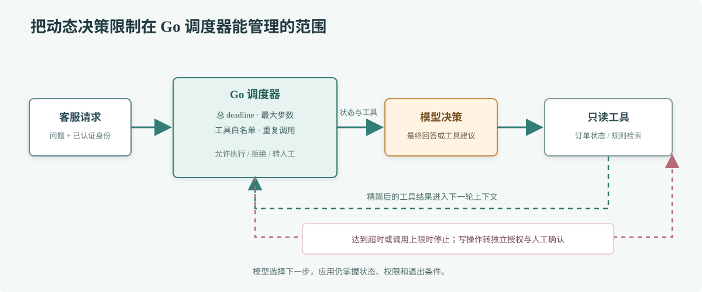

# 第 70 章 Agent 设计模式

## 场景

客服连续问：“订单到哪了？如果还没发货，退款规则是什么？”这不是一次模型生成就能可靠回答的问题：系统需要先查订单，再按结果决定是否查规则，最后把证据合并成答复。模型可以选择下一步，但调用顺序、预算和访问范围由应用控制。

## 问题

把“Agent”做成没有上限的自主循环，会让一次客服请求产生多轮模型调用和重复工具请求。遇到模型反复搜索、工具失败后重试、或者上下文越来越长时，成本和延迟都会失控。更危险的是，模型提出了业务动作后，系统没有单独的人为确认或权限检查。

## 实现

先从固定工作流开始：身份验证、检索必要信息、生成答案、核对证据。只有当下一步确实要依据前一步结果选择时，才开放受限的 Agent 循环。每轮设置 deadline，总过程限制步数、工具次数和重复调用；只开放完成任务所需的只读工具。



> **图解**：每一轮模型先返回最终文字或一个工具建议；Go 调度器检查步数、工具白名单和重复参数后才执行。工具结果回到下一轮上下文，达到最终答案、时间预算或步数上限时都会退出循环。所有写操作走独立业务授权和确认流程。

示例源码：[`70-agent-design/main.go`](./70-agent-design/main.go)。它用一段可重复的模型轨迹演示调度器和只读查单工具；这种回放方式便于调试 Agent 控制逻辑，接入真实模型的消息适配见第 69 章。

```bash
cd 70-agent-design
ORDER_SERVICE_URL=http://localhost:8081/internal/orders \
CALLER_USER_ID=staff-42 \
go run . -question 'ORD-104288 目前是什么状态？'
```

把回放模型替换为线上模型客户端时，`Agent.Run` 的工具预算、身份边界和退出条件仍应保留；不要把这些限制交给 Prompt 自我约束。

## 原理

Agent 是围绕模型的应用编排方式，不是一个比模型更可靠的独立智能体。它把目标、当前状态和允许使用的工具交给模型，再把模型建议交给受控的调度器。调度器维护状态并决定继续、执行工具、转人工或结束。

固定工作流的每个步骤可以预先验证，适合账务、权限变更等确定性流程；Agent 循环能处理需要动态选择工具的任务，但难以穷举所有路径。生产系统通常把两者组合：主流程由代码控制，在受限子任务中允许模型选择少量只读工具。

要控制的不是只有轮数。还包括总 deadline、每个工具的超时、累计 token、重复调用、并发工具数、最大响应体和可见数据范围。模型多轮思考不应扩大用户原有权限。

## 最佳实践

- 先评估确定性流程是否足够；只有需要动态选择步骤时才开放 Agent 循环。
- 给每个 Agent 设可观测的状态、退出原因、轮数预算和总耗时预算。
- 工具清单保持短小且用途单一；查询与写入工具分开，写入要求显式授权与审计。
- 用幂等键、重复参数检测和请求 deadline 防止模型重试造成重复副作用。
- 保存可脱敏的决策轨迹：模型版本、提示模板版本、工具名、耗时和结果码。
- 使用回放轨迹复现失败路径，再用离线评测比较提示词、模型和工具说明的变化。
- 设计转人工和拒答路径；预算耗尽时返回可解释的失败状态，不让循环无限续跑。

## 排障

### Agent 重复调用同一个工具

检查模型输入里是否已有工具结果，工具是否返回了足够明确的状态，以及调度器是否限制重复参数。对于相同工具和相同参数，可以直接终止或把已有结果复用。

### 延迟和成本突然上升

按请求查看模型轮数、每轮 token、工具耗时和排队时间。先判断是模型多轮、下游慢还是重试放大，再缩小工具返回字段和上下文，并为总流程设置统一截止时间。

### 工具成功但 Agent 没有结束

确认 tool call ID 与结果消息正确关联，结果结构能被模型读取，循环是否设置了最终答案判定。达到上限时应返回明确的“需要人工核实”，而不是把半成品当成功答案。

### 模型尝试越权操作

调度器只接受白名单中的只读能力；后端再次验证用户和资源关系。不能因为 Prompt 写了“不允许”就假设模型不会请求退款、改价或读取其他用户数据。

## 面试题

**Q1：什么时候用工作流，什么时候用 Agent？**

A：路径明确、步骤和权限固定时用工作流；只有下一步需要根据结果动态选择时才用 Agent。混合设计通常比把整条业务链交给自主循环更容易控制。

**Q2：如何避免 Agent 无限循环？**

A：在 Go 调度层设置总 deadline、最大轮数、工具调用预算、重复参数检测和明确的结束状态；Prompt 里的“请适时停止”不能作为唯一保护。

## 小结

1. Agent 是由应用控制的模型编排循环。
2. 确定性步骤仍由普通 Go 代码负责，动态决策范围要尽量小。
3. 预算、权限、幂等、可观测性和人工接管都由调度层实现。
