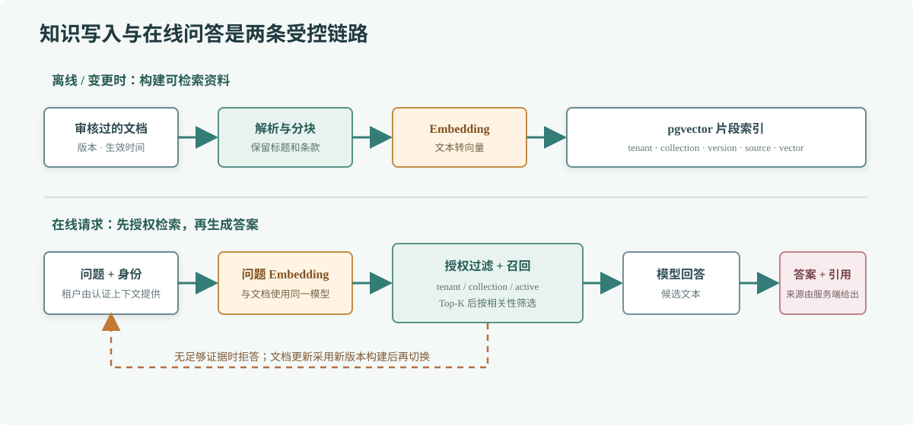

# 第 71 章 RAG 设计

## 场景

客服知识库每天更新退款、物流和优惠券规则。直接问模型，它可能依据过期训练数据回答；每次把全部文档塞进上下文，又会超过窗口并增加延迟。服务需要先找到当前用户有权查看的资料，再让模型围绕这些资料回答。

## 问题

RAG（Retrieval-Augmented Generation，检索增强生成）不是“把文本向量化然后聊天”这么简单。切分太大，命中后带回一堆无关内容；切分太小，条件和例外会被拆散；相似度高也不一定代表答案相关。多租户系统若只在应用层偶尔加过滤条件，还可能发生知识越权。

## 实现

先定文档生命周期：来源审核、解析、清洗、按语义分块、生成向量、带租户和版本元数据入库。查询时先验证身份和知识范围，再对问题做 embedding，检索少量候选片段，按相关性和权限过滤后才构造模型上下文。答案和引用来源分开返回，引用由服务端依据实际命中的片段生成。

> **图解**：左侧入库链路为每段资料保存来源、版本、租户和向量；右侧查询先按租户与知识集合做权限过滤，再检索相关片段交给模型生成候选答案。来源列表由 Go 服务根据真实命中结果返回，不让模型自行编造引用。

完整的查询命令和 pgvector 表结构在 [`71-rag-query`](./71-rag-query/README.md)。它连接一个 OpenAI 兼容的 embedding/chat 端点和 PostgreSQL，读取 `TENANT_ID` 后只检索该租户的片段。

运行前启动 PostgreSQL 并启用 pgvector，执行示例 schema；为知识片段生成与查询同一 embedding 模型产出的 768 维向量。具体服务地址、模型名、schema 和命令见示例 README。生产数据导入要先鉴权和审核，不应开放匿名写入。

## 原理

Embedding 把一段文本映射为向量，向量检索按照距离找语义上相近的片段。向量只适合召回候选，不是事实判断：关键词、编号、日期、否定条件和最新版本通常还需要全文检索、元数据过滤或重排器补充。

检索质量受文档解析、切分边界、embedding 模型和 query 写法共同影响。分块要保留标题、条款编号和必要上下文；重叠区可缓解边界断句，但也会增加重复结果与存储量。Top-K 和距离阈值需要用真实问题集调优，不存在适用于所有模型的固定数值。

每个片段应有稳定 ID、来源 URI、文档版本、生效时间、租户和访问范围。更新时先构建新版本，校验后切换当前版本；旧版本按审计与保留政策清理。向量库不是权限系统，查询条件必须跟身份绑定，数据库层也应避免应用查询遗漏导致越权。

## 最佳实践

- 先确保原文解析准确，再调分块和 embedding；扫描件、表格和脚注要单独处理。
- 为检索建立业务评测集，记录 Recall@K、无答案拒答率、引用准确率和端到端延迟。
- 组合使用向量召回、关键词检索、元数据过滤与重排，不以单一 cosine 分数作为答案正确性的证明。
- 检索条件包含租户、知识集合、文档状态和有效期；数据库启用行级安全时，运行账号不要拥有绕过策略的表所有权。
- 输入 Prompt 的片段保持来源标识和信任边界；外部文档中的指令仍是不可信文本。
- 检索为空或证据冲突时明确拒答或转人工，不用模型记忆补齐公司政策。
- 监控导入失败率、embedding 延迟、空召回率、引用覆盖率、token 用量和索引大小。

## 排障

### 召回内容看起来相关但回答不对

记录本次命中的 chunk ID、原文和过滤条件，确认片段是否包含完整适用条件。若资料本身正确，再区分是 query 改写、向量召回还是生成阶段丢失证据；不要只改 Prompt 掩盖召回问题。

### 新文档一直搜不到

检查解析、分块、embedding 与数据库写入各阶段的状态，确认新版本已切换为 active、向量维度与索引一致，并核对查询的租户和知识集合。

### 检索返回其他租户资料

立即停止相关查询并按安全事件处理。检查认证上下文到 SQL 过滤条件的绑定、连接池是否复用了会话级租户变量，以及数据库 RLS 是否被表所有者或高权限账号绕过。

### 向量查询变慢

查看候选规模、索引类型、过滤选择性和执行计划。租户过滤很强时，单一全局 ANN 索引可能先召回再过滤，导致有效结果不足；考虑分区、部分索引、过滤索引策略或混合检索，并用真实数据验证。

## 面试题

**Q1：为什么 RAG 能降低幻觉但不能消除幻觉？**

A：RAG 给模型补充本次可见的资料，但检索可能漏召回，片段可能不完整，模型也可能误读证据。需要同时评估召回、引用和生成质量，并允许无答案时拒答。

**Q2：Top-K 越大越好吗？**

A：不是。更大 K 可能增加召回，也会带入噪声、重复和更多 token。应根据评测集找到适合任务的候选数，并可先召回后重排。

**Q3：向量相似度能证明用户有权读这段资料吗？**

A：不能。相似度只描述向量距离。授权必须来自已验证身份和数据访问规则，并在检索查询里强制过滤。

## 小结

1. RAG 的效果取决于文档、分块、检索和生成的整条链路。
2. 相似片段是候选证据，答案质量需要评测和引用核验。
3. 租户、版本和有效期过滤必须在服务端与数据层落实。
4. 无可靠证据时，系统应拒答或转人工。
