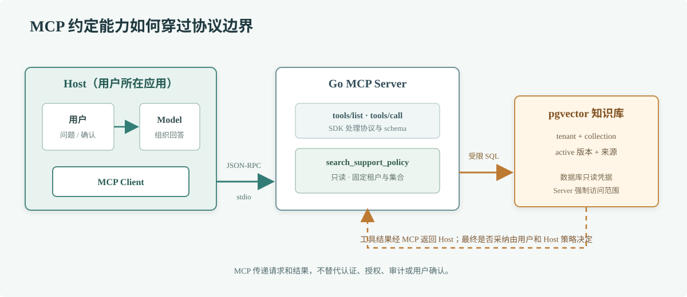

# 第 72 章 MCP 协议

## 场景

客服团队已有知识库检索服务，希望不同 AI 客户端都能查同一套退款政策。每个客户端各写一套私有插件，会造成接口重复、权限行为不一致和升级困难。MCP 提供一套客户端与上下文服务之间的协议，让 Host 能发现并调用 Server 暴露的能力。

## 问题

MCP 不是模型本身，也不保证工具调用安全。Host 管理用户交互和模型，Client 维护与某个 Server 的协议连接，Server 提供 Tools、Resources 或 Prompts。若把 Server 暴露成任意数据库代理、把工具描述当授权，或者用远程 stdio/HTTP 服务却没有身份认证，协议接通了仍然会越权。

## 实现

按当前 MCP 规范版本 `2026-07-28`，使用官方 Go SDK `github.com/modelcontextprotocol/go-sdk` 注册一个只读 `search_support_policy` 工具。Server 连接第 71 章的知识库，只按启动时配置的租户和集合查询；MCP Host 能调用工具，但不能直接拿到数据库凭据。

> **图解**：用户与模型在 Host 内交互，MCP Client 代表 Host 维护协议会话，Go Server 只暴露受限的知识库搜索工具。搜索仍由 Server 自己执行租户过滤并访问数据库；工具结果回到 Host 后由用户决定是否采纳，MCP 不替业务系统做权限判断。

服务端源码：[`72-mcp-server`](./72-mcp-server/README.md)。它通过 stdio 与本机 Host 通信，stdout 留给 SDK 传输 JSON-RPC 消息，日志只写 stderr。示例使用 Go SDK v1.8.0，对应 Go 1.25 及以上工具链；SDK 版本与规范版本的兼容关系以官方版本表为准。

本机 MCP Server 的配置由具体 Host 决定。典型配置只指定可执行文件和受限环境变量；不要把生产数据库密码写入仓库配置文件。stdio 模式依赖本机进程边界，部署成远程 HTTP 服务时必须使用协议规定的传输，并落实 OAuth、租户授权、来源校验和网络隔离。

## 原理

MCP 基于 JSON-RPC 2.0 定义初始化、能力协商、请求、响应和通知。连接建立后，客户端了解服务端声明的能力，再调用对应方法。Tools 面向可执行操作，Resources 面向可读取上下文，Prompts 面向可复用提示模板；它们的用途不同，不能把所有内容都包装成可执行工具。

stdio 适合本机 Host 启动和管理的子进程：一端读 stdin、一端写 stdout，协议消息之外的文本会破坏连接。Streamable HTTP 适合网络部署，但需要额外处理身份认证、Origin、防重放、会话和租户边界。MCP SDK 负责协议帧和 schema 处理，业务 Server 仍要负责查询、授权和数据最小化。

工具注解（如只读提示）是给客户端的描述信息，不是强制安全控制。客户端不能因为 `readOnlyHint` 就跳过用户确认，服务端也不能因为已声明只读就开放高权限数据库账号。

## 最佳实践

- 每个 Server 只提供清楚、窄范围、可审计的能力，避免通用 SQL、任意 HTTP 请求和 Shell 工具。
- 使用官方或维护活跃的 SDK，固定版本并核对该 SDK 支持的协议版本。
- 将工具输入设计成强类型结构，限制长度、枚举和结果数；超时和取消沿 Context 传递。
- stdio Server 禁止向 stdout 写普通日志；敏感调试信息写 stderr，并避免记录完整用户输入。
- 为每个 MCP Server 配置独立的最小权限凭据、租户范围和资源范围。
- 把 Host、Client 与 Server 的用户确认责任说清楚，尤其是写操作、外部副作用和敏感数据读取。
- 远程 Server 必须校验授权与请求来源；仅使用 HTTPS 不等于完成认证和授权。
- 工具描述应准确说明副作用和返回数据，结果中附带来源标识和更新时间。

## 排障

### Host 启动后看不到工具

确认可执行文件路径、工作目录和环境变量，检查程序是否在启动时退出。stdio 模式下先检查 stderr；不要把调试文本写进 stdout。再确认 Server 初始化时已注册工具并声明相应能力。

### 连接出现 JSON-RPC 解析错误

检查 stdout 是否混入 `fmt.Println`、日志或启动横幅，检查一行消息是否被截断，以及 Client 与 Server 是否协商了兼容的协议版本。优先使用 SDK transport，不要自行拼 JSON-RPC 帧。

### 工具能调用但返回无结果

检查工具输入 schema、embedding 端点、知识集合和租户过滤。区分“合法空结果”和“后端查询失败”，不要把数据库错误细节返回给模型。

### 用户能读取其他租户的知识

按安全事件处置。检查租户 ID 是否来自可信身份、是否只在进程环境启动时固定，以及查询和数据库 RLS 是否都有限制。共享多用户的远程 Server 不能用一个全局租户环境变量代替请求级认证上下文。

## 面试题

**Q1：MCP Host、Client 和 Server 分别负责什么？**

A：Host 管理模型、用户界面和整体策略；Client 维护与 Server 的协议连接并代表 Host 发起请求；Server 暴露 Tools、Resources、Prompts 等能力并执行自己的业务逻辑。

**Q2：声明只读工具后，是否就可以不做权限校验？**

A：不可以。注解只是提示；Server 必须强制身份、租户和资源授权，客户端仍要按风险决定是否需要用户确认。

## 小结

1. MCP 用统一协议连接 Host、Client 和上下文 Server。
2. SDK 解决协议实现问题，业务授权仍由 Server 和后端执行。
3. stdio 与远程 HTTP 的信任边界不同，日志和认证配置也不同。
4. 工具只暴露最小权限，结果附带来源，所有请求都有预算和审计。

## 参考资料

- [MCP Specification 2026-07-28](https://modelcontextprotocol.io/specification/2026-07-28)
- [Official MCP Go SDK v1.8.0](https://github.com/modelcontextprotocol/go-sdk/tree/v1.8.0)
