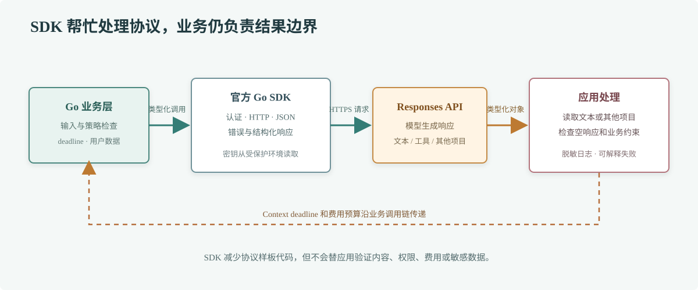

# 第 73 章 OpenAI Go SDK

## 场景

客服服务准备把本地验证过的问答链路接到 OpenAI API。团队需要处理认证、超时、错误和响应结构，也要随 SDK 版本演进而调整代码。直接拼 HTTP/JSON 虽然能发出请求，但容易漏掉响应变体和接口升级细节。

## 问题

SDK 能减少协议样板代码，不会替应用决定模型权限、数据留存和费用预算。若把 API Key 写进代码、把任意用户文本发给外部服务，或者把模型返回当成已校验的业务结果，SDK 的类型安全也帮不上忙。

## 实现

OpenAI 官方 Go SDK 的模块路径带主版本号：`github.com/openai/openai-go/v3`。本章按 2026-10-02 可查到的 v3.70.0 编写，官方模块要求 Go 1.25 及以上；升级时核对 SDK 的 Go 支持窗口和变更日志。



> **图解**：业务层构造类型化请求并传入 Context，SDK 负责认证、HTTP 传输和响应解码；应用拿到结构化 Response 后再选择要展示的文本。SDK 接管协议细节，但超时、数据边界、输出检查和费用控制仍由服务负责。

示例源码：[`73-openai-sdk`](./73-openai-sdk/README.md)。设置 `OPENAI_API_KEY` 后调用 Responses API：

```bash
cd 73-openai-sdk
OPENAI_MODEL=gpt-5.2 go run . -question '解释订单服务中为什么要给下游请求设置 deadline。'
```

示例不在命令行参数或日志中输出密钥；线上应通过密钥管理服务注入环境。将客户对话发送到外部模型前，先按数据分类策略处理个人信息，并确认组织允许使用对应服务。

## 原理

OpenAI Go SDK 将请求参数和响应对象映射为 Go 类型，减少手写 JSON 和字段拼写错误。Responses API 的输出是带类型的项目集合，可能包含文本、工具调用或其他内容；只需要普通文本时，`OutputText()` 可以汇总文本片段，但复杂工作流需要遍历结构化输出并按类型处理。

SDK 不改变远程调用的基本属性：网络会失败、请求会超时、服务可能限流，模型输出也可能为空或不符合业务预期。应为每次请求设置 Context deadline，并区分网络错误、HTTP 状态错误和应用层拒绝。SDK 的自动重试策略要按当前版本文档核对，写操作尤其要考虑重复提交。

模型名和可用能力由账号、区域及 API 服务决定。示例默认使用固定模型名，生产环境应从受控配置读取，并通过评测后再升级；不要把某个 SDK 常量是否存在误当成模型已对当前账号开放。

## 最佳实践

- 固定 SDK 主版本和经过验证的小版本，升级时阅读官方 changelog 并重新跑接口评测。
- 使用 `context.WithTimeout` 限制请求时间，服务端总体 deadline 不要被 SDK 调用预算覆盖。
- 复用 SDK Client，按应用生命周期管理连接；不要为每个请求重新初始化客户端。
- API Key 只从密钥管理系统或受保护环境注入，日志屏蔽认证头、用户原文和敏感响应。
- 对错误分类并记录请求 ID、模型、耗时和状态码；不要打印带密钥或完整敏感输入的请求对象。
- 对 Responses 中不同输出类型做显式处理；文本为空时按业务流程拒答或转人工。
- 评估上下文长度、模型费用、限流和并发，避免客户端重试与业务重试叠加放大请求。
- 使用兼容服务的自定义 Base URL 时，确认它实现了所用 API 的字段和行为，不要假设“兼容”意味着完全一致。

## 排障

### 请求返回认证错误

确认 `OPENAI_API_KEY` 是否在运行进程的环境中、密钥是否被撤销，以及项目是否有目标模型权限。不要把密钥复制到代码或调试输出里。

### SDK 无法编译

检查模块是否使用 `/v3` 导入路径、Go 工具链是否达到当前 SDK 的最低要求，以及 `go.mod` 是否固定在兼容版本。主版本升级可能包含源代码变更，不能只改版本号后假设代码不变。

### 响应没有文本

检查响应的状态和输出项目类型。模型可能返回工具调用、拒答或其他结构化内容；只有普通文本时才使用 `OutputText()` 展示。不要将空字符串伪装成成功答案。

### 请求延迟或限流

记录 SDK 调用耗时和 API 错误类别，确认 Context deadline、并发量、模型负载和重试策略。只对明确可重试的暂时错误做有界退避，并为请求设置上限。

## 面试题

**Q1：使用官方 SDK 后，为什么仍然要处理 HTTP 错误？**

A：SDK 帮忙发送请求和解码响应，但网络故障、限流、认证失败、模型拒绝和空响应仍需应用决定如何处理。

**Q2：`OutputText()` 能覆盖所有 Responses API 使用场景吗？**

A：不能。它适合提取普通文本；工具调用、结构化结果和多模态输出需要读取对应的类型化项目并走各自的业务处理。

## 小结

1. 官方 SDK 减少协议样板代码，不替业务做权限和数据治理。
2. 固定 SDK 版本和 Go 工具链，升级时核对官方变更。
3. Context、错误分类、重试预算和输出检查仍要由应用负责。
4. Responses 输出可能不只是文本，按类型处理才不会丢失语义。

## 参考资料

- [OpenAI Go SDK v3.70.0](https://github.com/openai/openai-go/tree/v3.70.0)
- [OpenAI API Reference](https://platform.openai.com/docs/api-reference/responses)
