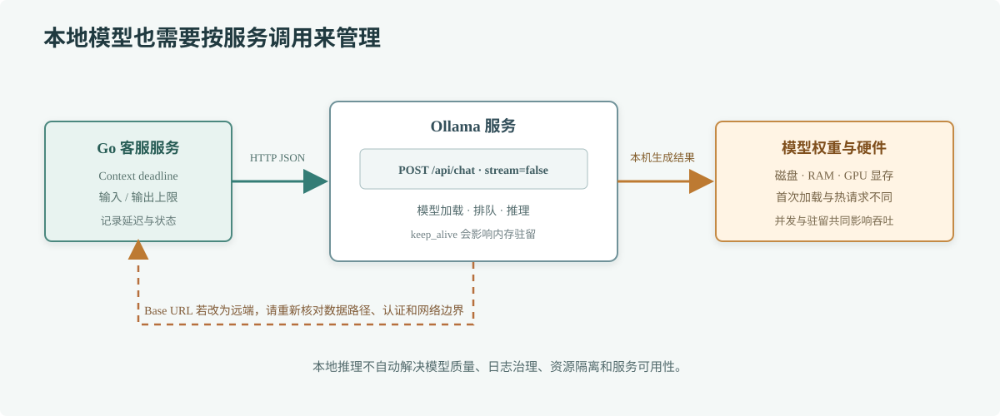

# 第 74 章 Ollama 实战

## 场景

客服团队要在开发环境验证问答 Prompt，但不能把尚未脱敏的工单文本发到公共模型 API。开发机上已有一张可用 GPU，团队希望通过本地模型跑通请求、衡量延迟，再决定是否部署到内网推理节点。

## 问题

“本地运行”不等于零成本或自动安全。模型文件占用磁盘和内存，CPU/GPU 推理速度差异明显；并发一上来会排队，模型切换会触发加载和显存争用。若把 Ollama 监听地址暴露到不可信网络，未认证的调用者也可能消耗机器资源。

## 实现

Ollama 提供本地 HTTP API。本章用 Go 标准库请求 `POST /api/chat`，从环境变量读取模型名和服务地址，设置超时、输出上限，并关闭 API 默认开启的流式响应，便于先看完整 JSON 结果。



> **图解**：Go 服务把系统规则和用户问题发给本机 Ollama，Ollama 负责加载权重并生成回答，再以 JSON 返回消息和推理统计。请求留在本机是否成立取决于实际 Base URL；若配置成远端地址，数据同样会离开当前机器。

示例源码：[`74-ollama-chat`](./74-ollama-chat/README.md)。先启动 Ollama 并拉取模型：

```bash
ollama pull qwen2.5:3b
```

再运行本地示例：

```bash
cd 74-ollama-chat
go run . -question '为什么客服答案需要附上知识来源？'
```

切换模型使用 `OLLAMA_MODEL`，修改服务地址使用 `OLLAMA_BASE_URL`。模型需要的内存和上下文能力以本机 `ollama show <模型名>` 为准，压测前用 `ollama ps` 确认当前加载情况。

## 原理

Ollama 管理模型文件、模型加载和推理请求。Go 服务仍通过 HTTP 发起调用；设置 `stream: false` 时收到完整 JSON，启用流式时则会收到多段 JSON 事件，需要逐行读取并处理中途错误和取消。

模型在第一次请求时可能需要加载权重，首次延迟通常高于热请求。`keep_alive` 可以影响模型驻留时间，但同时占用内存；模型尺寸、量化方式、上下文长度、GPU 显存和并发都会影响延迟与吞吐。不同模型对工具调用、结构化输出和多模态输入的支持也不同，不能仅凭标签推断能力。

本地推理改变的是模型请求的运行位置，不会自动处理日志、遥测、崩溃转储或其他下游依赖的数据路径。若系统还使用外部 embedding、数据库或 Agent 工具，仍需检查这些组件会接触哪些数据。

## 最佳实践

- 将 Ollama 绑定到受信任的本机或内网接口；不要直接把无认证端口暴露到公网。
- 限制 Go 服务到推理节点的并发和排队长度，给每次请求设置 deadline，并监控超时与等待时间。
- 明确模型名和版本，评估量化后的回答质量；镜像或模型文件升级前先跑业务评测集。
- 用 `keep_alive` 与可用内存预算协调热模型驻留，避免多模型常驻造成 OOM。
- 为输入和输出设置字节或 token 上限；不要把任意长聊天记录送入推理服务。
- 记录模型版本、耗时、输入/输出 token 统计和错误码，避免把完整敏感提示写进普通日志。
- 本地与远程推理通过配置切换，但要分别验证数据流、认证、网络和费用策略。

## 排障

### 连接被拒绝

确认 `ollama serve` 正在运行，检查 `OLLAMA_BASE_URL` 的主机、端口和网络策略。容器内的 `localhost` 指向容器本身；跨容器访问应使用 Compose 服务名或 Kubernetes Service DNS。

### 返回模型不存在

执行 `ollama list` 查看已下载模型，检查 `OLLAMA_MODEL` 是否包含正确标签，并按需运行 `ollama pull <model>`。

### 首次请求很慢

用 `ollama ps` 确认模型是否刚加载，分别测量冷启动与热请求。检查模型大小、GPU 是否可用、显存余量和并发排队，避免只拉长客户端超时。

### JSON 解析错误

确认请求体显式设置 `stream: false`。若开启流式，不能把整个响应当作单个 JSON 对象解析；应按 Ollama 的流式事件格式逐条解码并响应取消。

### 本地进程内存持续偏高

查看当前常驻模型和 `keep_alive` 配置，确认是否同时加载多个模型。用受控的模型驻留策略和并发上限验证内存曲线；不要仅依据模型参数量估算运行内存。

## 面试题

**Q1：为什么 Ollama 第一次请求通常更慢？**

A：模型权重可能需要从磁盘加载到内存或显存，冷启动还会包含运行时准备。热请求复用已加载模型，延迟通常不同，所以压测要分别记录冷、热路径。

**Q2：本地模型是否代表用户数据不会离开本机？**

A：只有模型调用地址确实是本地时，该次调用才留在本机。日志、追踪、embedding、检索和工具调用仍可能把数据发送到其他系统。

## 小结

1. Ollama 管理本地模型和推理，本质上仍通过 HTTP 服务调用。
2. 冷启动、模型驻留、显存和并发共同影响生产延迟。
3. `/api/chat` 默认流式，读取完整 JSON 时要显式关闭流式。
4. 本地部署仍需核对网络暴露、日志和周边数据流。
