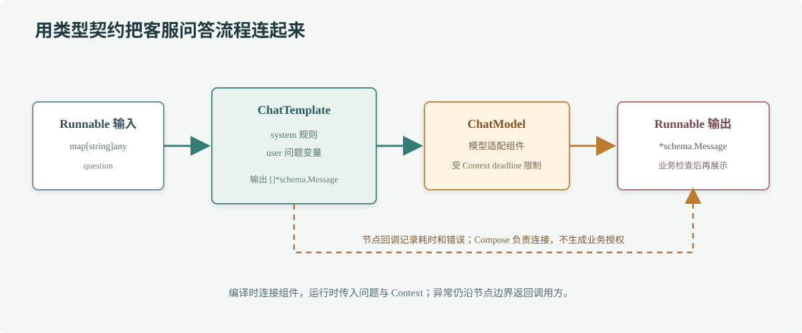

# 第 75 章 Eino 框架

## 场景

知识库服务已经能检索到退款规则，也接好了模型。接下来要把身份、检索、Prompt、模型和输出检查组合成可复用流程；如果每个 Handler 都手写一遍，参数传递、超时和观测很快会变得不一致。

## 问题

框架能统一组件接口和编排方式，但不会自动让业务正确。把所有步骤都包成抽象节点会增加调试成本；忽略节点输入输出、错误和取消语义，又会让流程无法维护。Agent 的自由循环也不应取代本来就确定的业务流程。

## 实现

Eino 提供 ChatModel、ChatTemplate、Retriever、Tool 等组件接口，也提供 Compose Chain/Graph 和 ADK Agent 开发能力。组件的具体实现由 `eino-ext` 提供。本章用 ChatTemplate 和 OpenAI ChatModel 组成一个 Chain：输入是带问题的 map，输出是 Eino 的 `schema.Message`。



> **图解**：`Runnable` 接收问题变量，ChatTemplate 把它整理成带角色的消息，ChatModel 调用模型并返回 `schema.Message`。每个节点都有明确的数据类型；检索器和权限检查可在合适位置接入，但流程的授权条件仍应由业务代码提供。

示例源码：[`75-eino-chain`](./75-eino-chain/README.md)。配置 `OPENAI_API_KEY` 和 `OPENAI_MODEL` 后运行：

```bash
cd 75-eino-chain
go run . -question '订单已经进入配送，还能直接取消吗？'
```

示例使用 Eino v0.9.21 和 `eino-ext` OpenAI ChatModel v0.1.13。不同模型服务的兼容性、Go 版本要求和字段支持要结合固定版本核对。

## 原理

Eino 把模型、提示模板、工具和检索器抽象成组件，再用 Compose 建立有类型的执行图。构造阶段负责连接节点并检查类型；`Compile` 生成可复用的 Runnable；运行时用 Context 传递取消和调用选项。图可以加入 Lambda、条件分支、并行节点和子图。

当流程固定时，Chain 或 Graph 让节点边界更清楚，也方便在节点周围加回调、指标和追踪。ADK 则适合需要模型选择工具、管理 Agent 状态或人工中断恢复的场景。两者可以配合，但没有必要为了使用框架而把简单的两三步业务变成自主 Agent。

模型和工具实现位于扩展模块；框架层的接口不保证每家服务的参数、流式行为、错误和工具格式完全一致。升级 Eino 或扩展后，要检查组件契约并重新验证实际模型调用。

## 最佳实践

- 先写清每个节点的输入、输出和失败方式，再决定是否需要 Compose。
- 可确定的权限检查、租户过滤和数据写入由 Go 业务节点执行，不让模型自行决定。
- 为模型调用和工具节点传递 Context deadline，避免流程结束后仍有后台请求运行。
- 通过回调或统一中间件记录节点名、耗时、错误和 trace ID；脱敏 Prompt 与返回内容。
- 固定 Eino 和扩展模块版本；单独评测模型变化，不把框架升级与模型升级混为一次改动。
- 对 Runnable 设置并发和请求预算；共享的客户端或组件应确认其生命周期与并发语义。
- 流式节点需要逐段处理错误、取消和输出完成状态，不能只验证正常结束。
- 保留简单的单元边界：模板、权限、检索、模型适配和业务校验应能分别排查。

## 排障

### Chain 编译失败

按错误中的节点查看上游输出类型和下游输入类型。ChatTemplate 通常把变量 map 转成消息列表，ChatModel 接收消息列表；中间插入 Lambda 时要确认函数签名精确匹配。

### 模型请求时报错

检查 `eino-ext` 的 ChatModel 配置、密钥、模型名、Base URL 和该服务支持的 Chat Completions 字段。Eino 的组件接口统一，不代表底层服务请求语义一致。

### 取消请求后流程仍未结束

确认入口使用的 Context 传到 Runnable、ChatModel 和自定义 Lambda；下游 HTTP 调用需要使用传入的 Context。若某节点自行创建 `context.Background()`，取消信号就会被截断。

### 生产流程和本地结果不同

记录固定版本、模板版本、模型名、检索来源和节点耗时。先用同一输入回放，区分是模型差异、上下文差异、组件版本变化还是数据源变化。

## 面试题

**Q1：Eino 的 Chain/Graph 与 ADK Agent 有什么区别？**

A：Chain/Graph 侧重由应用明确连接组件和控制执行路径；ADK Agent 侧重让模型在受限能力内选择下一步。确定性业务流程优先使用前者，需要动态工具决策时再考虑 Agent。

**Q2：使用 Eino 后还需要做模型适配和错误处理吗？**

A：需要。Eino 统一组件接口，具体模型扩展仍受服务端参数、模型能力和网络故障影响；应用还要设置 deadline、解释错误并检查输出。

## 小结

1. Eino 将模型、Prompt、检索和工具连接成可编排组件。
2. Chain/Graph 适合明确流程，ADK 适合有限范围内的动态决策。
3. 类型检查和组件抽象不能代替业务授权、数据治理和可观测性。
4. 固定 Eino 与扩展版本，并用实际业务输入验证升级。

## 参考资料

- [Eino v0.9.21](https://github.com/cloudwego/eino/tree/v0.9.21)
- [Eino Quick Start](https://www.cloudwego.io/docs/eino/quick_start/)
- [Eino OpenAI ChatModel extension v0.1.13](https://github.com/cloudwego/eino-ext/tree/main/components/model/openai)
