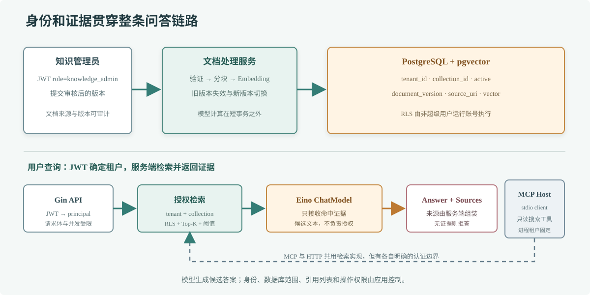

# 第 76 章 AI 知识库系统

## 场景

公司要把客服政策、产品手册和操作流程做成内部知识库。客服从后台提问后，系统必须只搜索当前租户已审核且生效的资料，给出带来源的候选答案；其他 MCP Host 也希望复用同一套只读检索能力。

## 问题

把 Chat API、向量数据库和聊天页面连起来，不等于知识库系统。线上还要回答：谁能导入文档、用户能查哪个租户、旧版本何时失效、没有证据怎么办、MCP 工具如何限制范围，以及模型和数据库不可用时服务怎样失败。

## 实现

项目把职责放在清楚的边界里：Gin API 验证 JWT 并从签名声明中取得租户；知识层负责文档版本、分块、embedding 和 pgvector；RAG 层将命中片段交给 Eino ChatModel 生成候选答案，并由服务端返回真实引用；单独的 stdio MCP 进程暴露只读搜索工具。



> **图解**：文档先经审核和版本化导入，片段与租户、集合、来源一起存入 pgvector。HTTP 用户请求通过 JWT 绑定租户后才检索，Eino 只基于命中证据生成候选答案；MCP Host 使用独立 stdio Server 调用相同搜索服务。引用由检索服务返回，不由模型编造。

完整工程：[`76-ai-knowledge-base`](./76-ai-knowledge-base/README.md)。本地部署包含 PostgreSQL/pgvector 和 Ollama；API 提供管理员导入、知识问答和健康检查，另有 `cmd/mcp` 作为 MCP Host 可启动的 stdio Server。

```bash
cd 76-ai-knowledge-base
docker compose up --build -d
```

启动后按工程 README 创建本地 JWT、导入审核过的示例政策，再请求 `/v1/knowledge/query`。生产环境需换掉 Compose 中的开发密钥，使用身份服务签发 JWT，并按组织要求配置数据库凭证、TLS、模型端点、备份和审计。

## 原理

一个问答请求依次经过身份验证、租户过滤、问题 embedding、向量召回、相关性筛选、模型生成和来源组装。模型只能看到检索返回的有限片段；即使它错误引用或遗漏资料，响应里的来源列表仍由服务端根据真实命中结果提供。

文档导入先解析和分块，再在数据库事务外生成 embedding，最后用短事务切换该文档的 active 版本。失败时旧版继续可查。租户通过 JWT 绑定到数据库查询，并用 PostgreSQL RLS 作第二层保护；应用连接使用非超级用户角色。

HTTP API 与 MCP Server 共用同一检索服务，但信任边界不同：HTTP 使用请求级身份；本机 stdio MCP 由 Host 为受信任进程配置固定租户和集合。远程 MCP 多租户部署不能复用固定环境租户，必须在 Server 层实现请求级认证和授权。

## 最佳实践

- 生产身份从可信 JWT 验证；租户、角色和集合范围不从 Prompt 或模型参数推断。
- 只让知识管理员导入资料，保留来源、版本、生效状态和操作审计。
- embedding 模型及维度在导入与查询间保持一致；升级时构建新版本再切换。
- 检索为空、距离过远或资料冲突时拒答或转人工，不让模型用训练记忆补齐政策。
- 对 HTTP 请求大小、问题长度、输出长度、并发和总 deadline 设上限。
- 数据库账号使用最小权限，启用 RLS；MCP 工具不接收任意 SQL、租户 ID 或写操作。
- 来源 URI 仅作证据标识；前端展示链接时还需校验协议与访问权限。
- 监控导入、embedding、召回、生成和模型费用的分段指标，不记录未脱敏原文。
- 对检索命中率、引用正确率、拒答率、延迟和跨租户隔离建立回归评测。

## 排障

### 导入成功但查询不到资料

确认 API 写入的 tenant/collection 与查询 JWT 和请求体一致；检查文档 active 版本、embedding 维度、距离阈值和 Ollama 模型配置。

### RLS 拒绝查询

检查 API 是否在同一个事务里执行 `set_config('app.tenant_id', ..., true)` 和检索语句，并确认运行账号不是表所有者、超级用户或 `BYPASSRLS` 角色。

### Eino 调用失败

检查模型扩展支持的 API、Base URL、模型名和密钥；确认 Ollama 的 OpenAI 兼容端点已加载模型。分别用健康请求和单独模型调用定位网络、鉴权或配置问题。

### MCP Host 看不到搜索工具

用同一环境手动启动 `go run ./cmd/mcp`，查看 stderr 的启动错误；确保 stdout 没有被日志污染，并核对 Host 配置的命令、数据库地址和固定租户。

### 答案和来源看起来不匹配

检查服务返回的真实命中片段和模型输出。引用列表由服务端生成，但模型仍可能误读证据；出现事实错误时，先看解析和检索，再看 Prompt 和模型评测。

## 面试题

**Q1：为什么租户过滤要同时放在应用查询和数据库 RLS？**

A：应用过滤表达业务范围，RLS 能在查询漏写租户条件时再挡一层。两层都必须基于可信身份；若连接角色能绕过 RLS，数据库策略就没有保护作用。

**Q2：为什么引用由服务端而不是模型返回？**

A：模型可以生成不存在的文档 ID。服务端根据本次真实检索结果组装来源，能证明哪些资料实际提供给了模型，但仍不能单独证明答案正确。

**Q3：为什么 MCP stdio 示例采用固定租户？**

A：stdio 子进程通常由一个本地 Host 按用户或工作区启动，进程环境可以形成清楚的信任边界。一个远程 Server 同时服务多个用户时，应按每个请求的认证上下文动态授权。

## 小结

1. AI 知识库是身份、文档、检索、生成、引用和运维共同组成的服务。
2. 租户授权与文档生命周期不能交给模型或 Prompt。
3. RAG 和 MCP 共用受限检索能力，但使用各自正确的身份边界。
4. 生产质量要靠数据、权限、证据和分段指标共同验证。
