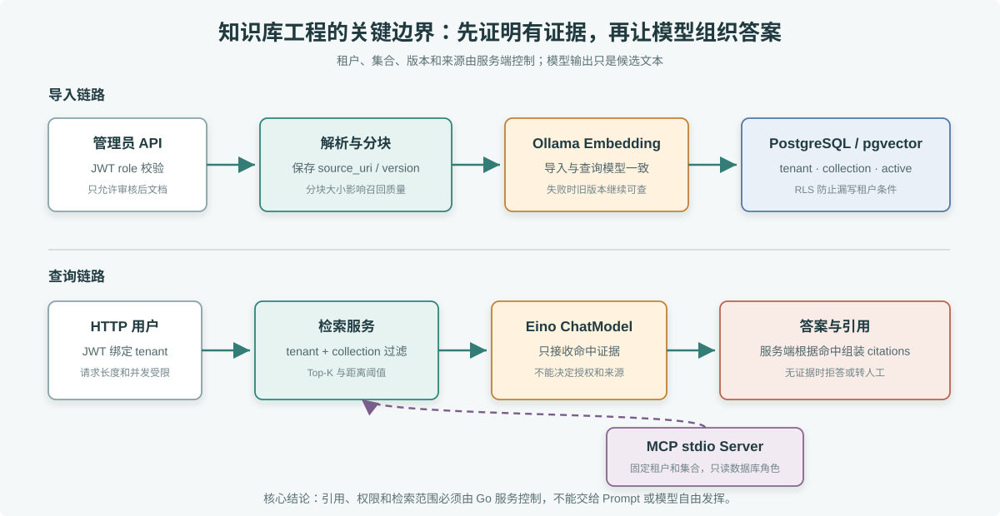

# 企业客服 AI 知识库

本项目把第 71–75 章的技术组合成一个可运行服务：Gin HTTP API、JWT 租户身份、PostgreSQL/pgvector、Ollama Embedding、Eino ChatModel 和只读 stdio MCP Server。API 与 MCP 使用不同的数据库角色；MCP 的 `kb_reader` 只有查询权限。



> **图解**：上半部分是导入链路，管理员 API 校验角色后解析文档、生成 embedding，并把租户、集合、版本和来源写入 pgvector；下半部分是查询链路，HTTP 请求通过 JWT 取得租户范围，检索服务只返回当前租户和集合的命中片段，Eino 基于证据生成候选答案。MCP stdio Server 复用同一检索服务，但使用固定租户和只读数据库角色。

## 本地启动

需要 Docker Compose、Go 1.25 或更新版本，以及可用的 Ollama 服务。Compose 会启动数据库和 API；Ollama 在宿主机运行，容器内地址固定为 `http://host.docker.internal:11434`。

```bash
ollama pull nomic-embed-text
ollama pull qwen2.5:3b
cp .env.example .env
docker compose up --build -d
```

`.env.example` 中的密钥仅供本机学习。对公网、团队或生产环境部署前必须换成密钥管理系统生成的值。

## 取得本地演示 Token

```bash
go run ./cmd/devtoken -tenant demo-tenant -roles knowledge_admin,knowledge_reader
```

命令从 `.env` 的 `KB_JWT_SECRET` 和 `KB_JWT_ISSUER` 读取配置，输出仅用于本机的短期 JWT。

## 导入文档和提问

```bash
export KB_TOKEN='上一步生成的本地 token'

curl -sS http://localhost:8080/v1/knowledge/documents \
  -H "Authorization: Bearer $KB_TOKEN" \
  -H 'Content-Type: application/json' \
  -d '{"collection_id":"support-policy","document_key":"refund-policy","version":"2026-10-01","title":"退款与优惠券规则","source_uri":"support://policy/refund","text":"订单尚未支付时，取消订单不产生退款。已支付且未发货的订单取消后，支付服务按原渠道发起退款。优惠券是否恢复取决于券是否仍有效及活动规则。"}'

curl -sS http://localhost:8080/v1/knowledge/query \
  -H "Authorization: Bearer $KB_TOKEN" \
  -H 'Content-Type: application/json' \
  -d '{"collection_id":"support-policy","question":"已支付订单取消后，优惠券会恢复吗？"}'
```

文档导入只接受 `knowledge_admin` 角色。查询响应中的 citations 来自实际检索记录，不由模型生成。

## MCP Server

MCP Host 可以在本机启动 `go run ./cmd/mcp`。程序从 `.env` 读取 `MCP_DATABASE_URL`、`OLLAMA_BASE_URL`、`OLLAMA_EMBED_MODEL`、`MCP_TENANT_ID` 和 `MCP_COLLECTION_ID`；数据库连接使用 `kb_reader`。stdio 进程固定服务一个租户与集合；远程多租户部署不能用这种固定环境配置代替请求级认证。

## API

- `GET /healthz`：进程存活
- `GET /readyz`：数据库可用
- `POST /v1/knowledge/documents`：管理员导入 Markdown/纯文本内容
- `POST /v1/knowledge/query`：在当前 JWT 租户内进行 RAG 问答

## 验收路径

本项目的验收重点不是模型能不能说出一段像样的话，而是身份、证据和引用边界是否可靠。建议按下面顺序验收：

1. 生成 demo-tenant 的管理员和读者 Token，管理员能导入文档，只有读者角色时导入应返回 403。
2. 导入 support-policy 集合下的退款政策，再用同一租户查询，响应中应包含 answer 和 citations。
3. 用另一个 tenant 重新生成 Token 查询同一 collection，应该查不到 demo-tenant 的资料。
4. 提一个资料里没有的问题，系统应拒答或明确说明证据不足，而不是凭模型记忆补政策。
5. 修改同一个 document_key 的 version 后重新导入，新查询应命中新版本；如果导入失败，旧版本仍应可查。
6. 启动 cmd/mcp，确认 MCP 工具只能搜索固定 tenant 和 collection，不能写入数据，也不能接收任意 SQL。

可执行的最小验收命令：

    go build ./...
    docker compose config
    go run ./cmd/devtoken -tenant demo-tenant -roles knowledge_admin,knowledge_reader

启动 Compose 后，再按“导入文档和提问”里的 curl 命令完成一次端到端请求。

## 数据与部署

数据库首次创建时由 `migrations/001_knowledge.sql` 初始化。API 使用非超级用户 `kb_app`，MCP 使用只读的 `kb_reader`；两个角色都不能绕过 RLS。tenant ID 同时进入参数化查询和 PostgreSQL RLS session setting。文档先生成所有向量，再在短事务中切换 active 版本；导入失败时旧版本仍可用。修改初始化 SQL 后，已有 Docker volume 不会自动重放迁移，需要用数据库迁移流程更新 schema。

生产部署要更换 JWT、PostgreSQL 和两个应用角色的本地示例密钥，启用 TLS 与密钥轮换，限制 API 与 Ollama 的网络来源，为 embedding 和模型 API 配置超时/并发预算，并按租户政策设置数据保留与审计。

## 故障演练

### readyz 失败

先确认数据库容器是否 healthy，再检查 KB_DATABASE_URL 是否使用 kb_app 账号。readyz 只证明数据库可连，不证明 embedding 或聊天模型可用。

### 导入接口返回 403

检查 Token 里的 roles 是否包含 knowledge_admin。不要为了调试把角色从请求体传入；角色只能来自服务端信任的 JWT。

### 查询没有命中

按顺序检查 tenant、collection_id、document_key、active 版本、embedding 模型名和 RAG_MAX_DISTANCE。导入和查询使用的 embedding 模型必须一致，维度也要一致。

### citations 为空但 answer 有内容

这是危险信号。知识库回答必须建立在本次检索证据上；如果没有 citations，应拒答或返回证据不足。排查时先看检索命中，再看 Prompt 和模型调用。

### MCP Host 启动后看不到工具

手动执行：

    go run ./cmd/mcp

如果 stderr 有数据库或配置错误，先修环境变量。stdio Server 的 stdout 只能输出协议消息，业务日志不能写到 stdout，否则 Host 会解析失败。

## 上线检查

- JWT issuer、secret 或公钥来自统一身份系统，本地示例密钥必须替换。
- 数据库账号分为 kb_app 和 kb_reader，应用账号不能是表所有者、超级用户或 BYPASSRLS 角色。
- Ollama 或线上模型服务有超时、并发和费用上限。
- 文档导入保留操作者、来源、版本和审核状态。
- 查询日志记录 request_id、tenant、collection、命中数量、距离和耗时，不记录未脱敏原文。
- 评测集覆盖命中问题、无答案问题、跨租户隔离和引用准确率。
- MCP 工具保持只读，不接收租户 ID、任意 SQL 或写操作参数。
