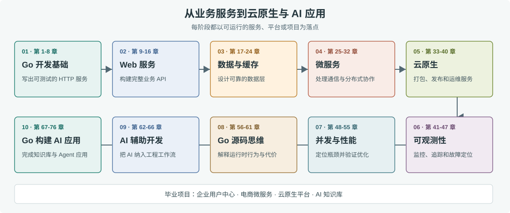

<div align="center">

# Go服务器开发工程师实战

### 从业务系统到云原生平台

**一本面向 Go 后端工程师的实战指南，覆盖业务开发 → 云原生 → AI 应用全链路**

[76 章](#内容总览) · [10 个阶段](#内容总览) · [4 个毕业项目](#毕业项目) · 可运行书稿

</div>

---

## 为什么选择这本书

- **真实业务驱动** — 每章从生产环境真实场景出发，拒绝玩具示例
- **先解决问题再讲原理** — 不做教科书式定义堆砌，代码必须可运行
- **完整技术栈覆盖** — Gin / MySQL / Redis / gRPC / Kafka / Docker / K8s / Prometheus 一站式掌握
- **故障排查方法论** — 不只教你怎么写，更教你怎么排查问题
- **面试题驱动** — 每章附带高频面试题，学完即可应对面试
- **AI 时代前瞻** — 涵盖 AI 辅助开发 + Go 构建 AI 应用两大前沿方向

## 目标读者

| 你是谁 | 你能获得什么 |
|--------|-------------|
| Go 后端工程师 | 从 CRUD 到云原生的完整进阶路线 |
| Go 服务器开发工程师 | 微服务、高并发、性能优化的生产经验 |
| 云原生工程师 | K8s 部署、CI/CD、可观测性体系搭建 |
| 想转 Go 的后端开发者 | 从零到生产级的系统化学习路径 |

## 技术栈

| 类别 | 技术 | 应用场景 |
|------|------|----------|
| Web 框架 | **Gin** | 高性能 HTTP 服务开发 |
| 关系型数据库 | **MySQL** | 业务数据存储与优化 |
| 文档数据库 | **MongoDB** | 灵活文档存储场景 |
| 缓存 | **Redis** | 缓存、分布式锁、消息队列 |
| ORM | **GORM** | 数据库操作抽象层 |
| RPC 框架 | **gRPC** | 微服务间高效通信 |
| 消息队列 | **Kafka** | 异步消息与事件驱动 |
| 容器化 | **Docker** | 应用打包与隔离运行 |
| 容器编排 | **Kubernetes** | 大规模容器调度管理 |
| 包管理 | **Helm** | K8s 应用部署管理 |
| CI/CD | **GitLab CI/CD** | 自动化构建与发布 |
| 监控 | **Prometheus + Grafana** | 指标采集与可视化 |
| 链路追踪 | **OpenTelemetry** | 分布式调用追踪 |
| AI 框架 | **Eino + MCP + RAG** | AI 应用开发 |

## 学习路线图



> **图解：** 上排从左向右覆盖 Go 基础、Web、数据和微服务，进入云原生；下排从右向左进入可观测性、性能、源码与 AI。四个毕业项目把这些阶段串成可交付的工程实践。

按阶段 README 查看学习目标和项目，再通过阅读站侧边栏进入具体章节。已完成章节的标题链接也可直接打开正文。

## 内容总览

| 阶段 | 章节 | 目标 | 占比 | 阶段项目 |
|:----:|:----:|------|:----:|:--------:|
| [一](./01-Go开发基础/README.md) | 1-8 | 开发简单业务服务 | 10% | 用户管理服务 |
| [二](./02-Web服务开发/README.md) | 9-16 | 独立开发业务系统 | 15% | 后台管理系统 API |
| [三](./03-数据存储与缓存/README.md) | 17-24 | 掌握企业核心数据层 | 15% | 订单系统 |
| [四](./04-微服务开发/README.md) | 25-32 | 掌握企业级服务开发 | 15% | 电商微服务系统 |
| [五](./05-云原生开发/README.md) | 33-40 | 达到高级 Go 工程师水平 | 20% | K8s 部署微服务平台 |
| [六](./06-可观测性与稳定性/README.md) | 41-47 | 具备生产环境运维能力 | 10% | 生产监控平台 |
| [七](./07-Go高并发与性能/README.md) | 48-55 | 成为高级开发工程师 | 10% | 秒杀系统 |
| [八](./08-Go源码思维/README.md) | 56-61 | 理解 Go 底层原理 | 5% | — |
| [九](./09-AI辅助开发/README.md) | 62-66 | 提升开发效率 | 加分项 | — |
| [十](./10-Go构建AI应用/README.md) | 67-76 | 具备 AI 应用开发能力 | 未来方向 | — |

## 章节目录

<details open>
<summary><b>第一阶段 Go 开发基础（10%）</b></summary>

| 章节 | 标题 |
|:----:|------|
| 1 | [Go 为什么适合服务器开发](./01-Go开发基础/01-Go为什么适合服务器开发.md) |
| 2 | [Go 开发环境与工具链](./01-Go开发基础/02-Go开发环境与工具链.md) |
| 3 | [Go 核心语法](./01-Go开发基础/03-Go核心语法.md) |
| 4 | [第一个 HTTP 服务](./01-Go开发基础/04-第一个HTTP服务.md) |
| 5 | [错误处理最佳实践](./01-Go开发基础/05-错误处理最佳实践.md) |
| 6 | [Interface 设计思想](./01-Go开发基础/06-Interface设计思想.md) |
| 7 | [Context 使用规范](./01-Go开发基础/07-Context使用规范.md) |
| 8 | [单元测试基础](./01-Go开发基础/08-单元测试基础.md) |

</details>

<details open>
<summary><b>第二阶段 Web 服务开发（15%）</b></summary>

| 章节 | 标题 |
|:----:|------|
| 9 | [Gin 框架实战](./02-Web服务开发/09-Gin框架实战.md) |
| 10 | [REST API 设计规范](./02-Web服务开发/10-RESTAPI设计规范.md) |
| 11 | [配置管理](./02-Web服务开发/11-配置管理.md) |
| 12 | [日志体系设计](./02-Web服务开发/12-日志体系设计.md) |
| 13 | [JWT 认证](./02-Web服务开发/13-JWT认证.md) |
| 14 | [文件上传服务](./02-Web服务开发/14-文件上传服务.md) |
| 15 | [OpenAPI 与 Swagger](./02-Web服务开发/15-OpenAPI与Swagger.md) |
| 16 | [接口版本管理](./02-Web服务开发/16-接口版本管理.md) |

</details>

<details open>
<summary><b>第三阶段 数据存储与缓存（15%）</b></summary>

| 章节 | 标题 |
|:----:|------|
| 17 | [MySQL 设计原则](./03-数据存储与缓存/17-MySQL设计原则.md) |
| 18 | [SQL 优化](./03-数据存储与缓存/18-SQL优化.md) |
| 19 | [事务与锁](./03-数据存储与缓存/19-事务与锁.md) |
| 20 | [GORM 最佳实践](./03-数据存储与缓存/20-GORM最佳实践.md) |
| 21 | [Redis 基础](./03-数据存储与缓存/21-Redis基础.md) |
| 22 | [Redis 缓存设计](./03-数据存储与缓存/22-Redis缓存设计.md) |
| 23 | [Redis 分布式锁](./03-数据存储与缓存/23-Redis分布式锁.md) |
| 24 | [MongoDB 实战](./03-数据存储与缓存/24-MongoDB实战.md) |

</details>

<details open>
<summary><b>第四阶段 微服务开发（15%）</b></summary>

| 章节 | 标题 |
|:----:|------|
| 25 | [gRPC 实战](./04-微服务开发/25-gRPC实战.md) |
| 26 | [Protocol Buffers](./04-微服务开发/26-ProtocolBuffers.md) |
| 27 | [服务注册发现](./04-微服务开发/27-服务注册发现.md) |
| 28 | [配置中心](./04-微服务开发/28-配置中心.md) |
| 29 | [Kafka 消息队列](./04-微服务开发/29-Kafka消息队列.md) |
| 30 | [异步任务设计](./04-微服务开发/30-异步任务设计.md) |
| 31 | [限流熔断降级](./04-微服务开发/31-限流熔断降级.md) |
| 32 | [分布式事务](./04-微服务开发/32-分布式事务.md) |

</details>

<details open>
<summary><b>第五阶段 云原生开发（20%）</b></summary>

| 章节 | 标题 |
|:----:|------|
| 33 | [Docker 实战](./05-云原生开发/33-Docker实战.md) |
| 34 | [Kubernetes 核心概念](./05-云原生开发/34-Kubernetes核心概念.md) |
| 35 | [Deployment 与 Service](./05-云原生开发/35-Deployment与Service.md) |
| 36 | [ConfigMap 与 Secret](./05-云原生开发/36-ConfigMap与Secret.md) |
| 37 | [Helm 实战](./05-云原生开发/37-Helm实战.md) |
| 38 | [GitLab CI/CD](./05-云原生开发/38-GitLabCI-CD.md) |
| 39 | [GitOps 思想](./05-云原生开发/39-GitOps思想.md) |
| 40 | [Kubernetes 故障排查](./05-云原生开发/40-Kubernetes故障排查.md) |

</details>

<details open>
<summary><b>第六阶段 可观测性与稳定性（10%）</b></summary>

| 章节 | 标题 |
|:----:|------|
| 41 | [Prometheus 监控](./06-可观测性与稳定性/41-Prometheus监控.md) |
| 42 | [Grafana 看板设计](./06-可观测性与稳定性/42-Grafana看板设计.md) |
| 43 | [OpenTelemetry 链路追踪](./06-可观测性与稳定性/43-OpenTelemetry链路追踪.md) |
| 44 | [日志体系设计](./06-可观测性与稳定性/44-日志体系设计.md) |
| 45 | [告警体系设计](./06-可观测性与稳定性/45-告警体系设计.md) |
| 46 | [性能压测](./06-可观测性与稳定性/46-性能压测.md) |
| 47 | [故障排查方法论](./06-可观测性与稳定性/47-故障排查方法论.md) |

</details>

<details open>
<summary><b>第七阶段 Go 高并发与性能（10%）</b></summary>

| 章节 | 标题 |
|:----:|------|
| 48 | [Goroutine](./07-Go高并发与性能/48-Goroutine.md) |
| 49 | [Channel](./07-Go高并发与性能/49-Channel.md) |
| 50 | [Mutex 与 RWMutex](./07-Go高并发与性能/50-Mutex与RWMutex.md) |
| 51 | [原子操作](./07-Go高并发与性能/51-原子操作.md) |
| 52 | [并发模式](./07-Go高并发与性能/52-并发模式.md) |
| 53 | [Goroutine 泄漏](./07-Go高并发与性能/53-Goroutine泄漏.md) |
| 54 | [pprof 性能分析](./07-Go高并发与性能/54-pprof性能分析.md) |
| 55 | [Benchmark 测试](./07-Go高并发与性能/55-Benchmark测试.md) |

</details>

<details open>
<summary><b>第八阶段 Go 源码思维（5%）</b></summary>

| 章节 | 标题 |
|:----:|------|
| 56 | [Slice 原理](./08-Go源码思维/56-Slice原理.md) |
| 57 | [Map 原理](./08-Go源码思维/57-Map原理.md) |
| 58 | [Channel 原理](./08-Go源码思维/58-Channel原理.md) |
| 59 | [GMP 调度器](./08-Go源码思维/59-GMP调度器.md) |
| 60 | [GC 原理](./08-Go源码思维/60-GC原理.md) |
| 61 | [net/http 源码](./08-Go源码思维/61-net-http源码.md) |

</details>

<details open>
<summary><b>第九阶段 AI 辅助开发（加分项）</b></summary>

| 章节 | 标题 |
|:----:|------|
| 62 | [AI 开发工作流](./09-AI辅助开发/62-AI开发工作流.md) |
| 63 | [AI 生成测试](./09-AI辅助开发/63-AI生成测试.md) |
| 64 | [AI 代码审查](./09-AI辅助开发/64-AI代码审查.md) |
| 65 | [AI 辅助重构](./09-AI辅助开发/65-AI辅助重构.md) |
| 66 | [AI 辅助架构设计](./09-AI辅助开发/66-AI辅助架构设计.md) |

</details>

<details open>
<summary><b>第十阶段 Go 构建 AI 应用（未来方向）</b></summary>

| 章节 | 标题 |
|:----:|------|
| 67 | [LLM 基础](./10-Go构建AI应用/67-LLM基础.md) |
| 68 | [Prompt 工程](./10-Go构建AI应用/68-Prompt工程.md) |
| 69 | [Function Calling](./10-Go构建AI应用/69-Function-Calling.md) |
| 70 | [Agent 设计模式](./10-Go构建AI应用/70-Agent设计模式.md) |
| 71 | [RAG 设计](./10-Go构建AI应用/71-RAG设计.md) |
| 72 | [MCP 协议](./10-Go构建AI应用/72-MCP协议.md) |
| 73 | [OpenAI Go SDK](./10-Go构建AI应用/73-OpenAI-Go-SDK.md) |
| 74 | [Ollama 实战](./10-Go构建AI应用/74-Ollama实战.md) |
| 75 | [Eino 框架](./10-Go构建AI应用/75-Eino框架.md) |
| 76 | [AI 知识库系统](./10-Go构建AI应用/76-AI知识库系统.md) |

</details>

## 毕业项目

完成全部学习后，通过四个项目整合章节内容。每个项目的范围、验收条件和代码起点见[毕业项目指南](./毕业项目/README.md)。

## 阅读指南

### 前置知识

- 掌握一门编程语言基础语法
- 了解基本的 Linux 命令
- 了解 HTTP 协议基本概念

### 学习建议

1. **第 1-5 阶段**为核心内容（75%），建议按顺序完整学习
2. **第 6-7 阶段**为进阶内容，建议结合实际项目实践
3. **第 8 阶段**为原理深入，可在工作中遇到问题时查阅
4. **第 9-10 阶段**为前沿方向，可根据兴趣选学
5. **毕业项目**建议在前 5 阶段完成后开始第一个，逐步推进

### 本地阅读站

项目使用 MkDocs Material 展示章节导航、全文搜索、代码复制和 SVG 图解。安装 [uv](https://docs.astral.sh/uv/) 后，在仓库根目录运行：

```bash
uv run --with-requirements requirements-book.txt python scripts/read_book.py
```

然后打开 <http://127.0.0.1:8000>。每张技术图下方都有加粗的“图解”段落，说明图中的节点、箭头和阅读结论；较宽的 SVG 会按屏幕宽度缩放。阅读站运行期间会自动同步书稿改动，新章节和配图说明会进入目录与搜索。

### iPhone 离线阅读

在仓库根目录运行下面的命令，生成适合 iPhone“图书”App 的 EPUB 文件：

```bash
uv run --with-requirements requirements-book.txt python scripts/build_epub.py
```

生成文件位于 `dist/Go服务器开发工程师实战.epub`。通过 AirDrop 或 iCloud Drive 发送到 iPhone，点开文件并选择“图书”即可离线阅读；章节、技术图解和代码示例会随书打包。

## 每章结构

每章遵循统一的写作模板，确保学习体验一致：

```
场景 → 问题 → 实现 → 原理 → 最佳实践 → 排障 → 面试题 → 小结
```

## 如何参与

本书持续更新中，欢迎提出建议和改进意见。

如有问题或反馈，请通过 [Issues](https://github.com/dongdonglog/Today_DO_U_GoLang-/issues) 提交。

## License

本项目仅供学习交流使用。
