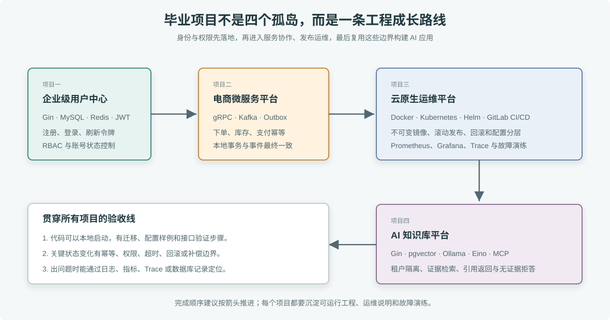

# 毕业项目

四个项目把本书的章节示例组合成可部署、可验收的工程。项目代码起点分布在对应章节目录中；涉及多个章节的项目需要在最终交付时整理成独立仓库，不能把单章示例当作完整平台。



> **图解**：四个毕业项目按能力递进组织：用户中心先解决身份、权限和数据约束；电商平台把服务通信、事件和幂等串起来；云原生运维平台负责构建、发布、监控和故障处置；AI 知识库在这些边界之上增加检索、引用和 MCP 只读工具。读者不应跳过前面的工程边界直接做最后的 AI 应用。

## 项目一：企业级用户中心

**技术栈：** Gin、MySQL、Redis

用户中心为后台管理系统和订单服务提供统一身份。注册与登录使用 MySQL 保存账户和权限，Redis 保存短期状态与撤销信息；客户端携带短期访问令牌访问受保护接口。

**可运行工程：** [user-center](./user-center/README.md)。它整合了 Gin、MySQL、Redis、JWT、刷新令牌轮换、登录限流、管理员启停账号、Docker Compose 和 OpenAPI。

**代码来源：** 第 9 章 `02-Web服务开发/09-gin-framework/example7-admin-api`；第 11 章 `02-Web服务开发/11-config/example5-admin-config`；第 13 章 `02-Web服务开发/13-jwt/example7-admin-auth`；第 17 章 `03-数据存储与缓存/17-mysql/example2-admin-mysql`。

**交付范围：**

- 用户注册、登录、退出、访问令牌刷新和管理员禁用账户。
- 密码使用专用哈希算法保存；登录失败有限速，错误响应不泄露账户是否存在。
- 使用 RBAC 控制路由权限，区分未认证、无权限和资源不存在。
- MySQL 保存账户、角色、角色绑定和刷新令牌族；Redis 缓存撤销状态和限流计数。
- 提供数据库迁移、配置样例、OpenAPI 文档、容器镜像和健康检查。

**验收条件：** 并发注册同一邮箱只能创建一个账户；刷新令牌轮换后旧令牌不能再次使用；禁用用户后旧访问令牌在规定窗口内失效；管理员与普通用户请求同一路由得到符合预期的 2xx、401 或 403；依赖不可用时服务返回稳定错误且不泄露凭证。

## 项目二：电商微服务平台

**技术栈：** gRPC、Protocol Buffers、Kafka、Redis、MySQL

项目实现商品查询和下单主路径，由订单、库存和支付服务协作。gRPC 用于同步调用，Kafka 用于订单状态事件，Redis 只承担明确有过期和恢复策略的缓存或协调职责。

**可运行工程：** [ecommerce-platform](./ecommerce-platform/README.md)。它包含 order-api、inventory gRPC、outbox-relay、payment-worker、MySQL、Redis、Kafka、Docker Compose 和 OpenAPI。

**代码来源：** 第 25 章 `04-微服务开发/25-grpc`；第 27 章 `04-微服务开发/27-servicediscovery`；第 29 章 `04-微服务开发/29-kafka`；第 30 章 `04-微服务开发/30-async-task`；第 31 章 `04-微服务开发/31-ratelimit-circuitbreaker`；第 32 章 `04-微服务开发/32-distributed-transaction`。

**交付范围：**

- 下单、预占库存、支付确认、取消和退款状态流转。
- gRPC 接口有 deadline、错误码、健康检查和向后兼容的 Protobuf 演进规则。
- Kafka 消费支持幂等、重试、死信和重复投递；订单事件通过 Outbox 与本地事务保持一致。
- 库存更新使用数据库条件更新或明确的锁协议，不以缓存锁替代最终一致性校验。
- 每个服务可独立启动，提供本地依赖编排、迁移脚本和端到端故障演练步骤。

**验收条件：** 重复下单请求不会创建重复订单；库存不会超卖；Kafka 重复投递不会重复扣库存或创建支付；下游超时会传播 deadline 并触发受控重试或补偿；服务重启后待处理 Outbox 和死信可以恢复。

## 项目三：云原生运维平台

**技术栈：** Go、Docker、Kubernetes、Helm、GitLab CI/CD、Prometheus、Grafana、OpenTelemetry

平台负责把一个 Go 业务服务从提交构建、部署到监控和故障处置。它不是另外造一个 Kubernetes 控制器，而是交付可重复的应用发布和运维流程。

**可运行工程：** [cloud-native-ops](./cloud-native-ops/README.md)。它整合了 Go 服务、Docker Compose、Prometheus、Grafana、Tempo、OpenTelemetry Collector、k6、Helm Chart、GitLab CI 和告警规则。

**代码来源：** 第 33–40 章 `05-云原生开发`；第 41–47 章 `06-可观测性与稳定性`。独立工程已把章节示例整理成一套可启动、可发布、可观测、可演练的交付物。

**本地可运行组件：**

```bash
cd cloud-native-ops
docker compose up --build -d
```

**交付范围：**

- 非 root、多阶段构建的镜像；Deployment 配置探针、资源请求/限制、滚动更新和优雅退出。
- ConfigMap 与 Secret 分离；Helm values 支持开发、预发和生产差异。
- GitLab 流水线运行静态检查、构建、镜像扫描和部署；生产使用受保护的发布步骤。
- Grafana 看板呈现延迟、吞吐、错误率、资源和依赖健康；Trace 与日志可通过关联 ID 定位请求。
- 包含一次滚动发布失败和一次下游故障的演练记录、止血步骤及复盘行动项。

**验收条件：** 未就绪 Pod 不接收流量；发布失败能停止或回滚；镜像按不可变摘要晋级环境；能从告警追到相关 Trace 和日志；采集组件不可用时业务服务仍可提供核心请求。

## 项目四：AI 知识库平台

**技术栈：** Go、Gin、PostgreSQL/pgvector、Ollama、Eino、MCP、RAG

平台将已审核文档导入向量库，按租户检索证据后生成候选回答，并通过 HTTP API 和只读 MCP 工具提供查询。

**可运行工程：** [ai-knowledge-base](./ai-knowledge-base/README.md)。实际工程位于 [`10-Go构建AI应用/76-ai-knowledge-base`](../10-Go构建AI应用/76-ai-knowledge-base/README.md)，包含 Docker Compose、数据库迁移、JWT API、版本切换、RLS、Ollama embedding、Eino ChatModel 和 MCP stdio Server。

工程 README 中包含本地验收路径、MCP 验证、故障演练和上线检查清单。

**交付范围：**

- 文档导入校验、版本切换、租户隔离、引用返回和无证据拒答。
- MCP Host 只能搜索固定租户和集合，使用独立只读数据库角色。
- 记录导入、召回、生成阶段的耗时与错误，但不记录未脱敏的文档原文。
- 评估召回命中、引用准确、拒答和跨租户隔离；模型升级前使用固定问题集回归。

**验收条件：** 租户 A 无法检索租户 B 的资料；旧文档版本切换失败时仍可查询旧版本；无匹配证据时不调用模型补充事实；返回引用只来自本次真实命中；MCP 工具无法写数据或执行任意 SQL。

## 完成顺序

1. 先完成用户中心，练习身份、权限和数据约束。
2. 再完成电商主路径，练习服务间调用、消息和补偿。
3. 将业务服务容器化并部署到 Kubernetes，补齐监控、发布和故障演练。
4. 最后完成知识库平台，复用身份、部署、可观测性和稳定性实践。

每个项目的提交物应包含源码、迁移或部署配置、配置样例、启动步骤、接口示例、故障演练和验收记录。章节中的单项示例用于学习组件行为；组合工程需要额外处理跨组件的身份、事务、重试、升级和运维边界。
