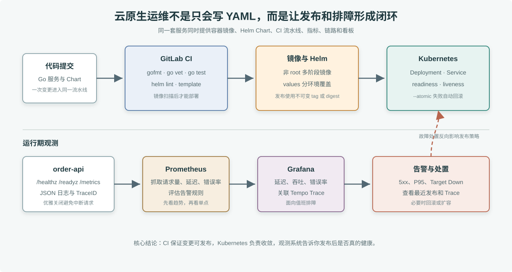

# 云原生运维平台

这个项目把第 33 到 47 章的内容整理成一个独立可运行工程。它交付的不是另一个业务系统，而是一条生产发布和运维闭环：Go 服务、容器镜像、Docker Compose 观测栈、Helm Chart、GitLab CI、Prometheus 告警和 Grafana 看板。

> **图解**：上半部分是发布链路，代码进入 GitLab CI 后依次做 Go 检查、Chart 校验、镜像构建、漏洞扫描和 Helm 发布；下半部分是运行期观测，服务暴露健康检查、指标和链路数据，Prometheus 与 Grafana 负责发现问题，告警再反向驱动回滚、扩容或修复发布流程。

## 本地启动

在项目目录运行：

    docker compose up --build -d

服务启动后可以验证：

    curl http://127.0.0.1:8080/healthz
    curl http://127.0.0.1:8080/readyz
    curl -X POST http://127.0.0.1:8080/orders

本地观测入口：

- Prometheus：http://127.0.0.1:9090
- Grafana：http://127.0.0.1:3000
- Tempo：http://127.0.0.1:3200

Grafana 默认没有设置生产密码，本项目只用于本机学习；真实环境要接入统一身份、TLS、持久化存储和备份。

## 压测与观测

运行一小段 k6 压测：

    docker compose --profile load run --rm k6

压测后在 Prometheus 查询：

    rate(http_requests_total{route="orders"}[1m])
    histogram_quantile(0.95, sum by (le) (rate(http_request_duration_seconds_bucket{route="orders"}[5m])))

服务会把 Trace 发送到 OpenTelemetry Collector，再写入 Tempo。Grafana 看板可以同时看请求量、错误率、延迟和 Trace 入口。

## Kubernetes 发布

Helm Chart 位于 deploy/helm/cloud-native-ops。先在本地渲染确认：

    helm lint deploy/helm/cloud-native-ops
    helm template cloud-native-ops deploy/helm/cloud-native-ops -f deploy/helm/cloud-native-ops/values-dev.yaml

发布到开发集群：

    helm upgrade --install cloud-native-ops deploy/helm/cloud-native-ops \
      --namespace dev --create-namespace \
      --values deploy/helm/cloud-native-ops/values-dev.yaml \
      --set-string image.repository=registry.example.com/acme/cloud-native-ops \
      --set-string image.tag=demo \
      --wait --atomic --timeout 3m

Chart 中包含：

- Deployment 和 Service。
- readinessProbe 与 livenessProbe。
- ConfigMap 管理服务名、环境和 OTel endpoint。
- Secret 引用占位，生产环境应使用外部密钥系统创建。
- requests 和 limits，避免应用无限制占用节点资源。

## GitLab CI

gitlab-ci.yml 包含五个阶段：

1. verify：运行 gofmt、go vet、go test。
2. validate：运行 helm lint 和 helm template。
3. build：构建非 root 多阶段镜像并推送到镜像仓库。
4. scan：用 Trivy 扫描镜像，高危和严重漏洞阻断发布。
5. deploy：staging 自动发布，production 需要手动确认。

生产发布使用 Helm 的 --atomic 和 --wait。发布失败时 Helm 会回滚到上一个成功版本，CI 再通过 kubectl rollout status 确认 Deployment 是否真正完成。

## 故障演练

### Pod 一直不 Ready

先看事件：

    kubectl describe pod -l app.kubernetes.io/instance=cloud-native-ops -n dev

常见原因是镜像拉取失败、环境变量缺失、readinessProbe 路径错误或应用监听端口不一致。先修配置，不要先扩容。

### Prometheus 抓不到指标

确认 Service 能访问应用的 /metrics，再看 prometheus/prometheus.yml 中 targets 是否指向正确服务名。Kubernetes 环境建议使用 ServiceMonitor 或服务发现，不要长期维护静态 targets。

### P95 延迟升高

先在 Grafana 看是否伴随错误率上升，再从 Tempo 里找慢请求 Trace。若慢在应用内逻辑，回到代码或数据库；若慢在资源争用，看 CPU、内存和 goroutine 指标；若刚发布过，优先比较新旧版本差异。

### 发布失败需要回滚

如果是 Helm 发布阶段失败，--atomic 会自动回滚。若发布后才暴露问题，执行：

    helm history cloud-native-ops -n dev
    helm rollback cloud-native-ops REVISION -n dev

回滚后仍要补一份复盘：触发条件、影响范围、发现方式、止血动作、根因、永久修复和需要新增的告警。

## 交付清单

- app：可观测 Go 服务，暴露 /healthz、/readyz、/orders 和 /metrics。
- Dockerfile：多阶段构建、scratch 运行、非 root 用户。
- docker-compose.yml：本地启动服务、Prometheus、Grafana、Tempo、OpenTelemetry Collector 和 k6。
- deploy/helm/cloud-native-ops：Kubernetes 发布模板。
- gitlab-ci.yml：从验证到生产发布的流水线。
- prometheus/alerts.yml：5xx、P95 延迟和目标不可用告警。
- grafana/dashboards/order-api.json：订单 API 看板。

这个项目的验收重点不是“页面能打开”，而是一次变更能从提交走到发布，发布后能被观测系统验证，出问题时能按证据定位并回滚。
