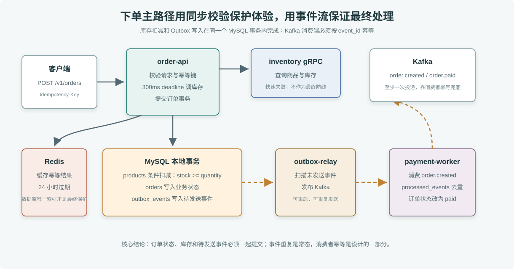

# 电商微服务平台

这个项目把第 25 到 32 章的微服务内容组合成一条下单主路径。它不是把所有电商能力一次做完，而是先把最容易出事故的链路跑通：下单、查库存、条件扣减、写订单、写 Outbox、发布 Kafka 事件、支付消费者幂等确认。

> **图解**：同步链路由 order-api 接收幂等下单请求，并通过 inventory gRPC 做快速库存检查；真正防止超卖的是 MySQL 事务里的条件扣减。订单和 Outbox 在同一个事务里提交，outbox-relay 负责把事件发布到 Kafka；payment-worker 按 event_id 幂等消费，所以 Kafka 重复投递不会重复支付。

## 服务边界

- order-api：HTTP 入口，处理幂等键、下单请求和订单查询。
- inventory：gRPC 服务，提供库存查询，接口来自 proto/inventory/inventory.proto。
- outbox-relay：扫描 MySQL outbox 表，把事件发布到 Kafka。
- payment-worker：消费 order.created 事件，幂等地把订单状态改成 paid，并写入 order.paid 事件。
- MySQL：保存商品、订单、Outbox 和已处理事件。
- Redis：缓存 24 小时幂等键结果，减少重复请求的数据库压力。
- Kafka：传递订单状态事件，消费者按事件 ID 做幂等。

## 本地启动

    cd 毕业项目/ecommerce-platform
    docker compose up --build -d

启动后会初始化一个商品：

- sku_id：1001
- 名称：Go 实战课程兑换券
- 库存：50
- 单价：19900 分

## 快速验证

    curl http://127.0.0.1:8081/healthz

    curl -X POST http://127.0.0.1:8081/v1/orders \
      -H 'Content-Type: application/json' \
      -H 'Idempotency-Key: demo-order-001' \
      -d '{"user_id":42,"sku_id":1001,"quantity":1}'

重复发送同一个 Idempotency-Key，不会重复扣库存，也不会创建第二个订单。返回的订单号可以继续查询：

    curl http://127.0.0.1:8081/v1/orders/NO-替换成返回的订单号

payment-worker 消费到 order.created 后会把订单状态改成 paid。真实生产环境通常还会增加支付网关回调验签、超时取消和退款补偿，本项目先聚焦下单主路径。

## 关键设计

### 为什么下单前还要调 gRPC 查库存

查库存不是最终一致性边界，只是快速失败和保护用户体验。真正防止超卖的是 MySQL 里的条件更新：

    UPDATE products SET stock = stock - ? WHERE sku_id = ? AND stock >= ?

只有这条语句影响一行，订单事务才会继续提交。

### 为什么要 Outbox

订单和事件在同一个本地事务里写入。API 不直接发 Kafka，避免出现“订单提交成功，但消息发送失败”的状态。outbox-relay 可以重启和重投，因此消费者必须按 event_id 幂等。

### Redis 的作用

Redis 只缓存短期幂等结果，过期时间是 24 小时。它不是唯一防线；MySQL 里的 idempotency_key 唯一索引才是重复下单的最终保护。

## 排障

### healthz 里 inventory 不可用

先看 inventory 容器是否启动，再看 order-api 的 EC_INVENTORY_TARGET 是否指向 inventory:9091。gRPC 调用有 300ms deadline，网络或服务阻塞时会快速失败。

### 订单一直停在 created

检查 outbox-relay 是否能连接 Kafka，以及 payment-worker 是否在同一个 topic 和 consumer group 上消费。也可以查看 outbox 表中 sent 是否为 1。

### 重复消息导致重复支付

payment-worker 会先写 processed_events，主键是 event_id 和 handler。重复事件只会提交一次，后续重复消费直接跳过。

### 库存不足但订单仍被创建

按当前实现，扣库存失败会回滚整个事务；如果看到异常订单，先检查是否有人绕过 order-api 直接写库，或者迁移中是否删除了条件更新。
