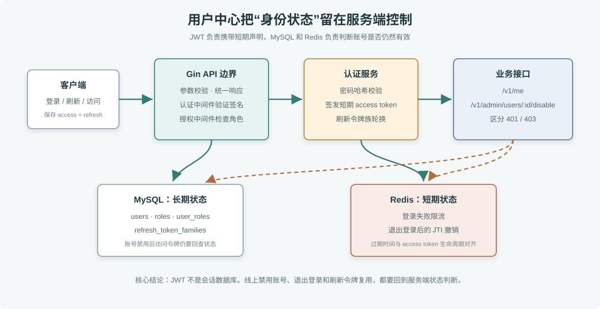

# 企业级用户中心

这个项目把前面 Gin、配置、JWT、MySQL、Redis 的章节内容组合成一个可运行服务。它面向后台管理系统和订单服务，负责注册、登录、刷新令牌、退出登录、管理员禁用账号和基础 RBAC。

> **图解**：请求先进入 Gin API 边界完成参数校验、认证和授权；密码、角色、账号状态和刷新令牌族保存在 MySQL；登录失败计数和退出后的访问令牌撤销保存在 Redis。图中的虚线表示业务接口每次访问都要回查服务端状态，所以管理员禁用账号或用户退出后，单靠 JWT 签名有效不会继续放行。

## 架构边界

- Gin 只处理 HTTP 入参、认证、授权和响应。
- MySQL 保存用户、角色、状态和刷新令牌；刷新令牌轮换在事务里完成。
- Redis 保存登录失败计数和已退出的访问令牌 JTI。
- 访问令牌每次请求都会回查用户状态，管理员禁用账号后旧访问令牌不能继续访问。

## 本地启动

    cd 毕业项目/user-center
    docker compose up --build -d

默认会创建管理员账号：

- 邮箱：admin@example.com
- 密码：admin12345

生产环境必须把 configs/.env.example 中的密钥、管理员密码和数据库口令换成外部配置或密钥管理系统提供的值。

## 快速验证

    curl http://127.0.0.1:8080/healthz

    curl -X POST http://127.0.0.1:8080/v1/auth/register \
      -H 'Content-Type: application/json' \
      -d '{"email":"alice@example.com","display_name":"Alice","password":"alice12345"}'

    curl -X POST http://127.0.0.1:8080/v1/auth/login \
      -H 'Content-Type: application/json' \
      -d '{"email":"admin@example.com","password":"admin12345"}'

登录响应中取出 access_token 和 refresh_token：

    curl http://127.0.0.1:8080/v1/me \
      -H "Authorization: Bearer $ACCESS_TOKEN"

    curl -X POST http://127.0.0.1:8080/v1/auth/refresh \
      -H 'Content-Type: application/json' \
      -d '{"refresh_token":"'$REFRESH_TOKEN'"}'

刷新成功后，旧刷新令牌会被标记为 revoked，再次使用会返回 401。

管理员禁用用户：

    curl -X POST http://127.0.0.1:8080/v1/admin/users/2/disable \
      -H "Authorization: Bearer $ADMIN_ACCESS_TOKEN"

被禁用用户再访问 /v1/me 会返回 403。

## 接口文档

OpenAPI 文件位于 openapi.yaml。本项目只保留关键接口，足够覆盖毕业项目一的验收路径。

## 排障

### API 启动时报 MySQL 连接失败

先看 docker compose ps 中 MySQL 是否 healthy；如果本机已有 3306 端口占用，可以调整 docker-compose.yml 的端口映射，不需要改容器内 DSN。

### 登录一直返回 429

同一邮箱和 IP 连续登录失败会写入 Redis，默认 15 分钟过期。开发环境可以重启 Redis 或执行 redis-cli DEL uc:login_fail:邮箱:IP 清理。

### 刷新令牌只能用一次

这是有意设计。刷新令牌轮换后，旧令牌立即失效；重复使用通常意味着客户端重试逻辑错误或令牌泄露，需要重新登录。

### 禁用用户后旧访问令牌仍能解析

JWT 签名有效只代表令牌没有被篡改。服务在中间件里会回查 MySQL 用户状态，状态为 disabled 时返回 403，因此业务接口不会继续放行。
